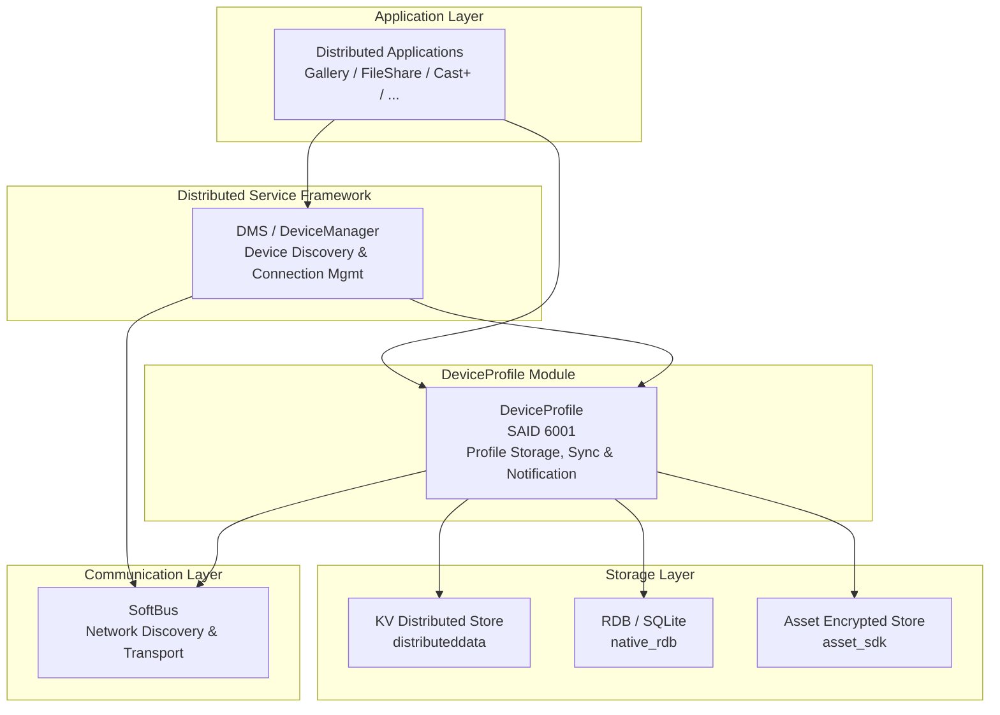
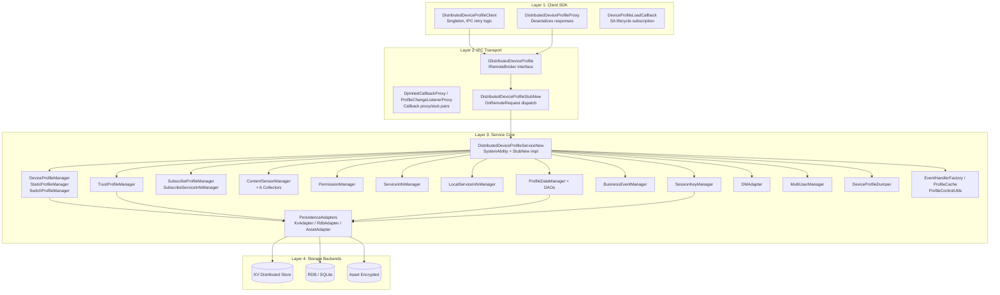

# 01 - 架构设计

> DeviceProfile 模块的架构总览：系统栈定位、内部分层、模块职责矩阵、存储架构、外部依赖和 Feature Flags。
> SAID: 6001 | 进程名: deviceprofile | 子系统: deviceprofile

## 1. 模块在系统栈中的定位

DeviceProfile 位于 OpenHarmony 分布式架构的**系统服务层**，介于分布式服务框架和存储/通信基础设施之间。上层应用通过 SDK 调用 DP，DP 通过 3 种存储后端持久化数据，并通过 SoftBus 获取底层网络信息。

关键交互关系：
- 应用和框架服务通过 `DistributedDeviceProfileClient`（SDK 层，基于 IPC）访问 DP
- DMS / DeviceManager 提供设备上线/下线事件，DP 通过 `DMAdapter` 消费这些事件
- DP 将结构化数据存储在 3 种后端中，并通过 KV 分布式同步间接使用 SoftBus 作为底层传输
- DP 依赖 5 个受监控的 SA 才能完成初始化：`SOFTBUS_SERVER_SA_ID`、`DISTRIBUTED_KV_DATA_SERVICE_ABILITY_ID`、`DISTRIBUTED_HARDWARE_DEVICEMANAGER_SA_ID`、`SUBSYS_ACCOUNT_SYS_ABILITY_ID_BEGIN`、`MEMORY_MANAGER_SA_ID`

## 2. 内部分层架构

DP 内部采用四层架构，从外到内依次为：客户端 SDK 层、IPC 传输层、服务核心层、存储后端层。每一层职责清晰，层间通过明确接口交互。

**各层职责概览：**

| 层 | 所在目录 | 职责 |
|-------|-----------|------|
| **Client SDK（客户端 SDK 层）** | `interfaces/innerkits/core/` | 外部 API 入口点，提供 IPC 代理，监听 SA 生命周期，对瞬时错误自动重试 |
| **IPC Transport（IPC 传输层）** | `common/`（共享） | 定义 `IDistributedDeviceProfile` 接口，Stub（分发）+ Proxy（序列化）配对，回调 stub/proxy |
| **Service Core（服务核心层）** | `services/core/` | 18 个 Manager 模块的业务逻辑，权限校验，持久化编排，事件通知 |
| **Storage Backends（存储后端层）** | 系统服务 | KV 分布式存储、RDB / SQLite、Asset 加密存储 |

## 3. 核心模块职责矩阵

| 模块 | 关键类 | 职责 | 源文件路径 |
|--------|---------------|----------------|-------------|
| **Service Entry（服务入口）** | `DistributedDeviceProfileServiceNew`、`DistributedDeviceProfileStubNew` | SA 生命周期管理（OnStart / OnStop / OnIdle / OnActive），Stub IPC 分发，Manager 的初始化和销毁，PostInit 顺序编排 | `services/core/include/distributed_device_profile_service_new.h`、`services/core/include/distributed_device_profile_stub_new.h` |
| **Device Profile Manager（设备画像管理器）** | `DeviceProfileManager`、`StaticProfileManager`、`SwitchProfileManager` | DeviceProfile / ServiceProfile / CharacteristicProfile 的核心 CRUD，KV 数据变更监听器，死亡通知接收器，同步订阅管理，静态能力画像管理，分布式开关状态管理 | `services/core/include/deviceprofilemanager/device_profile_manager.h`、`services/core/include/deviceprofilemanager/static_profile_manager.h`、`services/core/include/deviceprofilemanager/switch_profile_manager.h` |
| **Trust Profile Manager（信任画像管理器）** | `TrustProfileManager` | TrustDeviceProfile 和 AccessControlProfile 的 CRUD，基于 RDB 的 ACL 表管理（trust_device、access_control、accesser、accessee 四个表），LNN ACL 区分，解除信任时级联删除 | `services/core/include/trustprofilemanager/` |
| **Subscribe Profile Manager（订阅管理器）** | `SubscribeProfileManager`、`SubscribeServiceInfoManager` | Profile 变更订阅管理，向已注册的监听器分发事件（通过 IPC 回调），初始化完成通知，PinCode 失效通知，ServiceInfo 变更通知 | `services/core/include/subscribeprofilemanager/` |
| **Content Sensor Manager（内容传感器管理器）** | `ContentSensorManager` + 6 个采集器：`SystemInfoCollector`、`SyscapInfoCollector`、`DmsInfoCollector`、`PasteboardInfoCollector`、`CollaborationInfoCollector`、`SwitchStatusCollector` | 启动时采集设备静态能力，动态加载采集器插件，开关状态采集 | `services/core/include/contentsensormanager/` |
| **Permission Manager（权限管理器）** | `PermissionManager` | 调用者身份校验，依据 `permission/permission.json`（caller process name 到允许的 API 方法列表的映射），token 身份检查 | `services/core/include/permissionmanager/` |
| **Service Info Manager（服务信息管理器）** | `ServiceInfoManager` | ServiceInfo CRUD，双层 KV 存储（设备绑定 + 全局），发布状态管理，ServiceInfo 变更的订阅/通知 | `services/core/include/serviceinfo_manager/` |
| **Local Service Info Manager（本地服务信息管理器）** | `LocalServiceInfoManager` | LocalServiceInfo CRUD（基于 RDB），PIN 交换类型管理，PinCode 存储 | `services/core/include/localserviceinfomanager/` |
| **Session Key Manager（会话密钥管理器）** | `SessionKeyManager` | 会话密钥的 CRUD，通过 Asset 加密存储，用户作用域密钥隔离 | `services/core/include/sessionkeymanager/` |
| **Business Event Manager（业务事件管理器）** | `BusinessEventManager` | 业务事件注册、回调通知、事件存储 | `services/core/include/businesseventmanager/` |
| **Profile Data Manager（画像数据管理器）** | `ProfileDataManager` + DAO：`DeviceProfileDao`、`ProductInfoDao`、`DeviceIconInfoDao` | 基于 RDB 的结构化画像数据管理，产品信息，设备图标信息，批量操作 | `services/core/include/profiledatamanager/` |
| **DM Adapter（设备管理适配器）** | `DMAdapter` | DeviceManager 集成：消费设备上线/下线事件，设备上线时触发 E2E 同步，离线清理，信任级别传播 | `services/core/include/dm_adapter/` |
| **Multi User Manager（多用户管理器）** | `MultiUserManager` | 多用户 Profile 隔离，获取前台用户 ID，用户作用域键后缀管理 | `services/core/include/multiusermanager/` |
| **Persistence Adapters（持久化适配器）** | `KvAdapter`（IKvAdapter）、`RdbAdapter`（IRdbAdapter）、`AssetAdapter`、`ServiceInfoKvAdapter`、`BusinessEventAdapter`、`SwitchAdapter`、`ProfileDataRdbAdapter`、`LocalServiceInfoRdbAdapter`、`ServiceInfoRdbAdapter` | 存储抽象层：KV CRUD（单层 + 双层）、RDB CRUD（SQLite 通过 native_rdb）、Asset CRUD（加密）、表迁移、唯一索引管理 | `services/core/include/persistenceadapter/` |
| **DFX（可诊断性）** | `DeviceProfileDumper` | SA dump 支持（`-h` 帮助、通过 `hidumper` 输出画像内容）、诊断输出 | `services/core/include/dfx/` |
| **Utils（工具类）** | `EventHandlerFactory`、`ProfileCache`、`ProfileControlUtils`、`IpcUtils`、`ProfileUtils`、`ContentSensorManagerUtils`、`DistributedDeviceProfileLog` | 事件处理器管理（每个模块使用命名 handler），热路径访问的内存 Profile 缓存，控制流工具，IPC 辅助函数，日志（domain 0xD004400，tag DHDP） | `services/core/include/utils/`、`common/include/utils/` |

## 4. 存储架构

DP 使用三种存储后端，各有特定用途：

### 4.1 KV 分布式存储（`distributeddata_inner`）

- **适配器**：`KvAdapter`（IKvAdapter）、`ServiceInfoKvAdapter`、`BusinessEventAdapter`、`SwitchAdapter`
- **存储内容**：
  - 设备画像、服务画像和特征画像（KV 复合键）
  - ServiceInfo 条目（设备绑定的 KV 对）
  - BusinessEvent 条目
  - 开关状态条目
- **选择理由**：KV 存储提供 OH 设备之间的自动分布式同步能力。KV 数据会自动复制到受信任设备，使得 DP 无需直接管理传输即可同步 Profile 数据。每个设备维护自己的 KV 数据库，自动与受信任的对端同步。

### 4.2 RDB / SQLite（`native_rdb`）

- **适配器**：`RdbAdapter`（IRdbAdapter）、`ProfileDataRdbAdapter`、`ServiceInfoRdbAdapter`、`LocalServiceInfoRdbAdapter`
- **存储内容**：
  - 信任/访问控制表：`trust_device`、`access_control`、`accesser`、`accessee`
  - 结构化设备画像：`device_profile` 表
  - 产品信息：`product_info` 表
  - 设备图标信息：`device_icon_info` 表
  - 服务画像关系（通过 `service_profile` 表，通过外键 ID 关联）
  - 本地服务信息表
  - 订阅信任信息表
- **选择理由**：对于复杂的 ACL 查询（如"找到该设备+用户+token 的所有 accesser 画像"），需要关系完整性、索引查找和结构化 join。SQLite 为多表级联操作提供事务一致性（例如，删除一个信任设备会级联删除 accesser / accessee / access_control 行）。

### 4.3 Asset 加密存储（`asset_sdk`）

- **适配器**：`AssetAdapter`
- **存储内容**：会话密钥（加密的字节向量）
- **选择理由**：敏感密码学材料需要硬件级加密。会话密钥不能以明文形式存储在 KV 或 RDB 中。Asset SDK 提供防篡改的、硬件隔离的存储。

### 4.4 多用户键分发策略

- **默认用户（单用户模式）**：键格式为 `DEV#<deviceId>#SVR#<serviceName>#CHAR#<characteristicKey>`（前缀：`DEV_`、`SVR_`、`CHAR_`）
- **多用户模式**：在键末尾追加 userId 后缀，例如 `DEV#<deviceId>#SVR#<serviceName>#CHAR#<characteristicKey>#<userId>`
- **ServiceInfo 键**：格式为 `SERINFO#<udid>#<userId>#<serviceId>`，用于设备绑定的 ServiceInfo 条目
- 用户作用域隔离由 `MultiUserManager` 负责，它获取当前前台用户 ID 并应用相应的键后缀。

## 5. 外部依赖概览

以下按子系统分组列出外部依赖，估算依据 `bundle.json` 和源码使用情况：

| 子系统 | 组件 | API 调用数（估） | 用途 |
|-----------|-----------|-----------------|---------|
| **SoftBus** | `softbus_server` | 6-8 | 获取本地 UDID，通过 UDID 获取 networkId（及其反向查询），设备连接状态查询，KV 同步的底层传输 |
| **Distributed Data** | `kv_data_service` | 15-20 | KV 存储的初始化 / 获取 / 写入 / 删除，注册/注销数据变更监听器，注册/注销同步完成监听器，注册/注销死亡通知接收器 |
| **Device Manager** | `device_manager` | 8-12 | 设备上线/下线事件订阅，获取受信任设备列表，批量写入所有受信任设备，设备状态查询，信任级别传播 |
| **Account** | `account_os_account` | 3-5 | 获取前台用户 ID，订阅账号公共事件（解锁、切换），获取本地用户 ID |
| **Memory Manager** | `memory_manager` | 1-2 | 按需 SA 空闲管理（内存压力回调） |
| **SAMGR** | `samgr` | 10-15 | SA 注册（6001），获取 SA 代理，加载/卸载 SA，SA 状态变更监听器 |
| **RDB** | `native_rdb` | 12-18 | 创建表、插入/查询/更新/删除、创建唯一索引、数据库恢复、版本迁移 |
| **Asset** | `asset_sdk` | 5-7 | Asset 初始化、写入/更新/获取/删除会话密钥 |
| **HiSysEvent** | `hisysevent` | 3-5 | 同步成功/失败事件上报，Radar 故障日志 |
| **Event Handler** | `eventhandler` | 8-12 | 命名事件处理器（DP_HANDLER、static_cap 等）、投递任务、延迟任务 |
| **IPC** | `ipc`（iremote_broker） | 50+ | 所有客户端-服务端 IPC 通信，通过 IRemoteBroker、proxy/stub 配对、死亡通知接收器 |
| **nlohmann/json** / **cJSON** | `third_party/json`、`third_party/cJSON` | 5-8 | 解析 permission.json、静态能力 JSON、开关配置 JSON |

**注意**：DP 依赖 5 个 SA 先运行才能完全初始化。这些 SA 在 `DistributedDeviceProfileServiceNew` 的 `depSaIds_` 中跟踪：
1. `SOFTBUS_SERVER_SA_ID` — SoftBus
2. `DISTRIBUTED_KV_DATA_SERVICE_ABILITY_ID` — KV 数据服务
3. `DISTRIBUTED_HARDWARE_DEVICEMANAGER_SA_ID` — Device Manager
4. `SUBSYS_ACCOUNT_SYS_ABILITY_ID_BEGIN` — 账号子系统
5. `MEMORY_MANAGER_SA_ID` — 内存管理器

## 6. Feature Flags（编译时特性开关）

| 编译期标志 | 条件 | 启用效果 | 禁用/未设置效果 |
|-------------------|-----------|---------------------|------------------------------|
| `device_info_manager_capability` | 在 `deviceprofile.gni` 中设置 | 构建完整的 SDK 和服务模块 | SDK 构建最小化桩代码（`*_fail_to_support.cpp`），服务能力缩减 |
| `device_info_manager_supported_switch` | 在 `deviceprofile.gni` 中设置 | 开关画像管理启用（`SwitchProfileManager` 活跃，通过 KV 进行分布式开关同步） | 开关相关功能为空操作，设置 `-DDEVICE_PROFILE_SWITCH_DISABLE` |
| `dp_os_account_part_exists` | 当产品构建包含 `account_os_account` 部件时设置 | 多用户功能通过 `-DDP_OS_ACCOUNT_PART_EXISTS` 启用，`MultiUserManager` 活跃，KV 键带 userId 后缀 | 多用户功能编译排除；所有画像按单用户处理（userId = DEFAULT_USER_ID = -1） |
| `DEVICE_PROFILE_SWITCH_DISABLE` | 当 `device_info_manager_common=true` 或开关不支持时设置 | 开关画像管理被编译排除 | SwitchProfileManager 及相关 API 可用 |
| `DEVICE_PROFILE_STATIC_DISABLE` | 在通用构建中设置 | 静态能力采集被编译排除 | StaticProfileManager、ContentSensorManager 采集器在启动时活跃 |

**组合效果示例**：一个 IoT（轻量）设备可能以 `device_info_manager_supported_switch=false` 和 `device_info_manager_capability=false` 编译，生成一个精简的 DP 服务——仅包含基于 KV 的核心 Profile CRUD，无开关管理，SDK 为最小化桩代码。而完整的手机/平板构建会启用所有标志。
