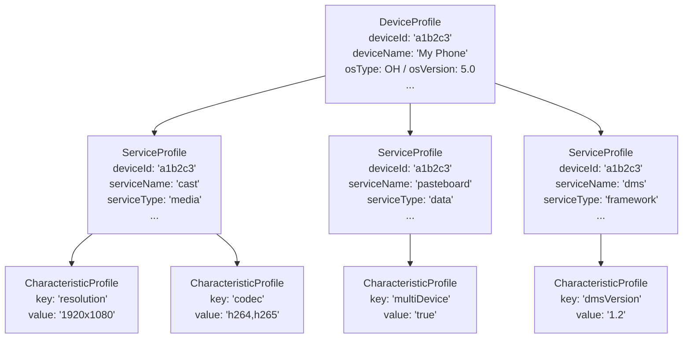

# 02 - 核心概念

> DeviceProfile 模块的领域概念：Profile 层级结构、Profile 类型、信任模型、订阅机制和同步模式。

## 1. Profile 层级结构

DeviceProfile 将设备信息建模为三层树状结构。每一层都是对上一层的细化——从通用的设备标识逐步深入到具体的服务能力细节。



**三层定义：**

- **DeviceProfile（顶层 — 设备画像）**：物理设备的身份标识。以 `deviceId`（UDID）为主键。包含不可变或变化缓慢的属性：设备名称、制造商、型号、OS 类型/版本、存储等。每台设备有且仅有一个 DeviceProfile。
- **ServiceProfile（中间层 — 服务画像）**：设备上运行的逻辑服务。以 `deviceId` + `serviceName` 为复合键。将相关的特征归入一个服务命名空间下。一台设备可以有多个 ServiceProfile（如 cast、pasteboard、dms、wifi_display 等）。
- **CharacteristicProfile（叶子层 — 特征画像）**：服务的某个具体能力或属性。以 `deviceId` + `serviceName` + `characteristicKey` 为复合键。存储实际的能力值。一个服务可以有多个 CharacteristicProfile（例如，cast 服务有 resolution、codec、latency 等特征）。

在多用户模式下，三层均携带 `userId` 和 `isMultiUser` 字段，使得完整复合键变为 `deviceId + serviceName + characteristicKey + userId`。

## 2. Profile 类型（按业务域划分）

### 2.1 设备标识

| 类型 | 关键类 | 描述 | 存储 |
|------|-----------|-------------|---------|
| **DeviceProfile** | `DeviceProfile` | 主要设备标识记录：deviceId、deviceName、deviceTypeName/Id、manufacturer、model、storage、osType、osVersion、apiLevel、osSysCap、wiseDeviceId、setupType、internalModel、productId、productName、registerTime | KV + RDB（profile_data 表） |
| **ProductInfo** | `ProductInfo` | 产品元数据：productId、model、productName、productShortName、imageVersion | RDB（product_info 表） |
| **DeviceIconInfo** | `DeviceIconInfo` | 设备图标元数据：productId、internalModel、subProductId、imageType、specName、version、url、icon（二进制） | RDB（device_icon_info 表） |

### 2.2 服务描述

| 类型 | 关键类 | 描述 | 存储 |
|------|-----------|-------------|---------|
| **ServiceProfile** | `ServiceProfile` | 设备上的服务注册信息：deviceId、serviceName、serviceType | KV |
| **ServiceInfo** | `ServiceInfo` | 更新的、更丰富的服务模型：udid、userId、serviceId、serviceOwnerTokenId、serviceOwnerPkgName、serviceRegisterTokenId、publishState、serviceType、serviceName、serviceDisplayName、customData、serviceCode、dataLen、extraData、version、description | KV（双层：设备绑定 + 全局） |
| **CharacteristicProfile** | `CharacteristicProfile` | 服务能力键值对：deviceId、serviceName、characteristicKey、characteristicValue | KV |

### 2.3 信任与访问控制

| 类型 | 关键类 | 描述 | 存储 |
|------|-----------|-------------|---------|
| **TrustDeviceProfile** | `TrustDeviceProfile` | 远端设备的信任关系：deviceId、deviceIdType、deviceIdHash、status（active/inactive）、bindType、peerUserId、localUserId | RDB（trust_device 表） |
| **AccessControlProfile** | `AccessControlProfile` | 连接 Accesser 与 Accessee 的 ACL 条目：accessControlId、accesserId、accesseeId、trustDeviceId、bindType、bindLevel、status、extraData | RDB（access_control 表） |
| **Accesser** | `Accesser` | 信任关系的发起方标识：accesserId、accesserDeviceId、accesserUserId、accesserBundleName、accesserTokenId、accesserAccountId、accesserDeviceName | RDB（accesser 表） |
| **Accessee** | `Accessee` | 信任关系的目标方标识：accesseeId、accesseeDeviceId、accesseeUserId、accesseeBundleName、accesseeTokenId、accesseeAccountId、accesseeDeviceName | RDB（accessee 表） |

### 2.4 本地服务

| 类型 | 关键类 | 描述 | 存储 |
|------|-----------|-------------|---------|
| **LocalServiceInfo** | `LocalServiceInfo` | 本地注册的、带认证元数据的服务：bundleName、deviceId、authBoxType、authType、pinExchangeType、pinCode、description、extraInfo | RDB（local_service_info 表） |

### 2.5 运营类

| 类型 | 关键类 | 描述 | 存储 |
|------|-----------|-------------|---------|
| **BusinessEvent** | `BusinessEvent` | 任意业务键值事件：businessKey、businessValue | KV |
| **SessionKey** | （字节向量） | 加密的会话密钥材料，按 userId + sessionKeyId 隔离 | Asset |

## 3. 概念对比表

### 3.1 DeviceProfile vs ServiceProfile vs CharacteristicProfile

| 维度 | DeviceProfile | ServiceProfile | CharacteristicProfile |
|--------|---------------|----------------|----------------------|
| **粒度** | 每台物理设备 | 设备上的每个服务命名空间 | 服务内的每个能力项 |
| **复合键** | `deviceId` | `deviceId + serviceName` | `deviceId + serviceName + characteristicKey` |
| **数量关系** | 每设备 1 个 | 每设备 0..N 个 | 每服务 0..N 个 |
| **典型内容** | 品牌/型号/OS 标识 | 服务类型分类 | 能力值（字符串） |
| **变更频率** | 极少（设备信息稳定） | 偶尔（服务安装/卸载） | 频繁（能力更新） |
| **主要用途** | 设备发现、兼容性检查 | 服务路由、能力分组 | 特性协商、能力匹配 |

### 3.2 ServiceProfile vs ServiceInfo

| 维度 | ServiceProfile（旧版） | ServiceInfo（新版） |
|--------|------------------------|---------------------|
| **字段数** | 3 个：deviceId、serviceName、serviceType | 17+ 个：udid、userId、serviceId、displayId、token IDs、publishState、serviceType、serviceName、serviceDisplayName、customData、serviceCode、dataLen、extraData、version、description |
| **发布状态** | 不建模 | 显式 `publishState` 字段 |
| **身份标识** | 仅基于设备 | 设备 + 服务注册 token + 用户感知 |
| **存储** | 单层 KV | 双层 KV（设备绑定 + 全局服务注册表） |
| **API** | `PutServiceProfile` / `GetServiceProfile` | `PutServiceInfo` / `DeleteServiceInfo` / `GetAllServiceInfoList` / `GetServiceInfosByUserInfo` |
| **变更通知** | 通过 ProfileChangeListener | 通过 ServiceInfoChange 回调（insert/update/delete） |
| **关系** | 简单的服务标签 | 丰富的服务注册，含所有权和发现元数据 |

### 3.3 TrustedDeviceInfo vs TrustDeviceProfile

| 维度 | TrustedDeviceInfo | TrustDeviceProfile |
|--------|-------------------|-------------------|
| **用途** | 来自 DeviceManager 的输入（设备发现数据） | 内部的持久化信任记录 |
| **关键字段** | networkId、authForm、deviceTypeId、osVersion、osType、udid、uuid | deviceId、deviceIdType、deviceIdHash、status、bindType、peerUserId、localUserId |
| **生命周期** | 瞬态（DM 在信任事件时提供） | 持久化（存储在 RDB trust_device 表中） |
| **使用场景** | `PutAllTrustedDevices()` 批量输入 | `GetTrustDeviceProfile()`、`GetAllTrustDeviceProfile()` 查询 |
| **是否包含状态** | 不包含 | 是（ACTIVE / INACTIVE） |

### 3.4 Accesser vs Accessee

| 维度 | Accesser | Accessee |
|--------|----------|----------|
| **角色** | 信任关系发起方（"谁发起访问"） | 信任关系目标方（"谁授予访问"） |
| **ID** | `accesserId`（自动生成） | `accesseeId`（自动生成） |
| **关键字段** | accesserDeviceId、accesserUserId、accesserBundleName、accesserTokenId、accesserAccountId、accesserDeviceName | accesseeDeviceId、accesseeUserId、accesseeBundleName、accesseeTokenId、accesseeAccountId、accesseeDeviceName |
| **关系** | 1 个 Accesser 关联 N 个 AccessControlProfile | 1 个 Accessee 关联 N 个 AccessControlProfile |
| **表** | `accesser` 表（RDB） | `accessee` 表（RDB） |

在典型的设备到设备信任场景中：
- 设备 A（发起方）创建一个 **Accesser** 记录来标识自己
- 设备 B（目标方）创建一个 **Accessee** 记录来标识自己
- 一个 **AccessControlProfile** 将它们关联起来：`accesserId -> accesseeId`，并附带 `trustDeviceId`、`bindType`、`bindLevel`

### 3.5 Dynamic Profile（动态画像） vs Static Profile（静态画像）

| 维度 | Dynamic Profile | Static Profile |
|--------|-----------------|----------------|
| **数据来源** | 运行时通过 ContentSensorManager 采集器采集 | 启动时从 JSON 配置文件加载 |
| **是否可随时间变化** | 是（如 WiFi 状态、剪贴板状态） | 否（对给定设备型号/构建版本不可变） |
| **存储** | KV 存储（跨设备同步） | KV 存储（仅本地，或同步） |
| **典型内容** | syscap、DMS 可用性、pasteboard、collaboration、开关状态 | 从 `static_capability.json` 预配置的设备能力 |
| **管理器** | `DeviceProfileManager` | `StaticProfileManager` + `StaticCapabilityCollector` + `StaticCapabilityLoader` |
| **Feature Flag** | 始终活跃 | 受 `DEVICE_PROFILE_STATIC_DISABLE` 控制 |

### 3.6 LNN ACL vs User-Bound ACL（用户绑定 ACL）

| 维度 | LNN ACL（本地网络协商） | User-Bound ACL |
|--------|-------------------------------------|----------------|
| **来源** | 同一局域网自动发现（SoftBus LNN） | 显式用户操作（设备绑定、账号关联） |
| **Bind Type** | 通常为 `SAME_ACCOUNT` 或 `SAME_GROUP` | `SHARE`、`POINT_TO_POINT`、`DIFF_ACCOUNT` |
| **是否在 GetAllAclProfile 中包含** | 否（被排除） | 是 |
| **是否在 GetAllAclIncludeLnnAcl 中包含** | 是 | 是 |
| **extraData 字段** | 可能包含 `IS_LNN_ACL` 标记 | 无 LNN 标记 |
| **生命周期** | 与网络存在性绑定 | 与信任绑定关系绑定 |

### 3.7 多用户 Profile vs 单用户 Profile

| 维度 | 单用户模式 | 多用户模式 |
|--------|-------------|------------|
| **isMultiUser** | `false` | `true` |
| **userId** | `DEFAULT_USER_ID`（-1） | 实际的数值型 userId |
| **KV 键格式** | `DEV#<deviceId>#SVR#<svc>#CHAR#<key>` | `DEV#<deviceId>#SVR#<svc>#CHAR#<key>#<userId>` |
| **Feature Flag** | 始终可用 | 需要 `dp_os_account_part_exists` 编译标志 + `-DDP_OS_ACCOUNT_PART_EXISTS` |
| **隔离性** | 所有用户共享同一份 Profile 数据 | 每个用户对同一设备/服务有独立的 Profile 数据 |

## 4. 存储键（Storage Keys）

### 4.1 KV Store 复合键

KV 存储中的 Profile 数据使用结构化复合键来编码层级关系：

```
DEV#<deviceId>
SVR#<deviceId>#<serviceName>
CHAR#<deviceId>#<serviceName>#<characteristicKey>
SERINFO#<udid>#<userId>#<serviceId>
```

**键前缀**（定义于 `distributed_device_profile_constants.h`）：
- `DEV_` — DeviceProfile 前缀
- `SVR_` — ServiceProfile 前缀
- `CHAR_` — CharacteristicProfile 前缀
- `SERINFO_` — ServiceInfo 前缀

**分隔符**：`#`（井号）

**多用户后缀**：当 `isMultiUser = true` 且 `userId != DEFAULT_USER_ID` 时，在任何键末尾追加 `#<userId>`。

**ServiceInfo 键**：`SERINFO#<udid>#<userId>#<serviceId>`，解析索引为：`SERINFO_INDEX=0, UDID_INDEX=1, USERID_INDEX=2, SERVICEID_INDEX=3`。至少需要 4 个键部分。

### 4.2 RDB 主键和复合键

信任/访问控制表使用自动生成的整数 ID 和复合唯一约束：

- `trust_device` 表：按 `(deviceId)` 唯一约束
- `access_control` 表：按 `(accesserId, accesseeId, trustDeviceId)` 唯一约束
- `accesser` 表：根据查询上下文不同，按 `(accesserId, accesserUserId, accesserTokenId)` 或 `(accesserId, accesserUserId, accesserBundleName)` 或 `(accesserId, accesserUserId, accesserAccountId)` 的复合键唯一约束
- `accessee` 表：与 accesser 对称

## 5. 订阅模型

### 5.1 SubscribeInfo 结构

一个 `SubscribeInfo` 代表订阅者对特定 Profile 变更的兴趣：

| 字段 | 类型 | 用途 |
|-------|------|---------|
| `saId` | `int32_t` | 订阅者服务的 System Ability ID（标识谁在订阅） |
| `subscribeKey` | `std::string` | 复合键模式，定义监听范围（deviceId、deviceId+serviceName、deviceId+serviceName+characteristicKey，或信任专用键） |
| `subscribeChangeTypes` | `std::unordered_set<ProfileChangeType>` | 需要接收通知的变更类型集合 |
| `listener` | `sptr<IRemoteObject>` | IPC 回调对象（IProfileChangeListener 代理），用于向订阅者投递事件 |
| `userId` | `int32_t` | 订阅的用户作用域（单用户模式下默认为 -1） |

### 5.2 Profile 变更类型

`ProfileChangeType` 枚举涵盖所有粒度的变更类型（定义于 `distributed_device_profile_enums.h`）：

| 枚举值 | 数值 | 含义 |
|------------|---------|---------|
| `TRUST_DEVICE_PROFILE_ADD` | 1 | 新增一个信任设备 |
| `TRUST_DEVICE_PROFILE_UPDATE` | 2 | 修改了一个信任设备画像 |
| `TRUST_DEVICE_PROFILE_DELETE` | 3 | 移除了一个信任设备（级联删除其 ACL 条目） |
| `DEVICE_PROFILE_ADD` | 4 | 创建了一个新的设备画像 |
| `DEVICE_PROFILE_UPDATE` | 5 | 修改了一个设备画像 |
| `DEVICE_PROFILE_DELETE` | 6 | 删除了一个设备画像 |
| `SERVICE_PROFILE_ADD` | 7 | 创建了一个新的服务画像 |
| `SERVICE_PROFILE_UPDATE` | 8 | 修改了一个服务画像 |
| `SERVICE_PROFILE_DELETE` | 9 | 删除了一个服务画像 |
| `CHAR_PROFILE_ADD` | 10 | 创建了一个新的特征画像 |
| `CHAR_PROFILE_UPDATE` | 11 | 修改了一个特征画像 |
| `CHAR_PROFILE_DELETE` | 12 | 删除了一个特征画像 |
| `TRUST_DEVICE_PROFILE_ACTIVE` | 13 | 信任设备变为活跃状态 |
| `TRUST_DEVICE_PROFILE_INACTIVE` | 14 | 信任设备变为非活跃状态 |

### 5.3 订阅者标识

订阅者通过 `saId`（其 System Ability ID）来标识。`SubscribeCompare` 和 `SubscribeHash` 类将 `(saId, subscribeKey)` 视为唯一标识符，用于订阅集合中的去重。

### 5.4 专用订阅类型

除通用的 ProfileChange 订阅外，DP 还支持以下专用订阅类型：

- **DeviceProfileInited**：`SubscribeDeviceProfileInited(saId, callback)` / `UnSubscribeDeviceProfileInited(saId)` — 当 DP 完成 PostInit 序列且 Profile 缓存就绪时通知。供依赖 DP 完全初始化的服务使用。
- **PinCodeInvalid**：`SubscribePinCodeInvalid(bundleName, pinExchangeType, callback)` / `UnSubscribePinCodeInvalid(bundleName, pinExchangeType)` — 当本地服务的 PinCode 失效时通知。
- **ServiceInfoChange**：`SubscribeAllServiceInfo(saId, listener)` — 在 ServiceInfo 插入/更新/删除事件时通知。
- **BusinessEvent**：`RegisterBusinessCallback(saId, businessKey, callback)` / `UnRegisterBusinessCallback(saId, businessKey)` — 当指定 businessKey 对应的事件发生时通知。

### 5.5 通知流程

```
发生 Profile 变更（Put/Update/Delete）
  -> Manager 将数据写入存储后端（KV/RDB）
  -> Manager 通知 SubscribeProfileManager
  -> SubscribeProfileManager 按 subscribeKey 匹配订阅者
  -> 通过 IProfileChangeListener 代理调用 IPC 回调
  -> 订阅者服务收到 ProfileChangeType + 变更数据
```

## 6. 同步模式

### 6.1 同步模式枚举

| 模式 | 数值 | 行为 |
|------|-------|----------|
| `PULL` | 0 | 仅从目标设备拉取 Profile 到本地设备 |
| `PUSH` | 1 | 仅将本地 Profile 推送到目标设备 |
| `PUSH_PULL` | 2 | 双向同步：推送本地并拉取远端（默认模式） |

### 6.2 OH 设备间同步

OH 设备之间的同步，DP 利用 KV 存储内建的分布式同步能力：

1. 调用 `SyncDeviceProfile(syncOptions)`，传入设备列表和同步模式
2. DP 通过 `distributeddata` 框架触发向指定设备的 KV 同步
3. KV 存储处理数据差异计算和网络传输（通过 SoftBus）
4. 同步完成后，在调用方代理上调用 `SyncCompletedCallback`
5. 远端设备的 KV 数据变更监听器触发，在远端触发 Profile 更新

### 6.3 非 OH 设备同步

与非 OpenHarmony 设备（或不支持 KV 分布式同步的设备）同步时：

1. DP 使用 `DpSyncAdapter`（`IDpSyncAdapter` 接口），该适配器以动态插件方式加载
2. 适配器从 `LIB_LOAD_PATH`（如 `/system/lib64/`）加载
3. 数据通过适配器的自定义协议序列化（非 KV 原生协议）
4. 同步的初始化/失败/完成事件通过 `SyncStatus`（SUCCEEDED / FAILED）跟踪
5. 如果适配器加载失败，返回 `DP_LOAD_SYNC_ADAPTER_FAILED` 错误

### 6.4 同步触发方式

- **按需同步**：通过 `SyncDeviceProfile()` 或 `SyncStaticProfile()` API 显式调用
- **自动同步（E2E）**：由 `DMAdapter` 在设备上线时触发——订阅设备上线事件并启动 `PUSH_PULL` 同步，确保端到端的 Profile 一致性
- **静态同步**：`SyncStaticProfile()` 同步从 JSON 配置加载的不可变静态能力画像
