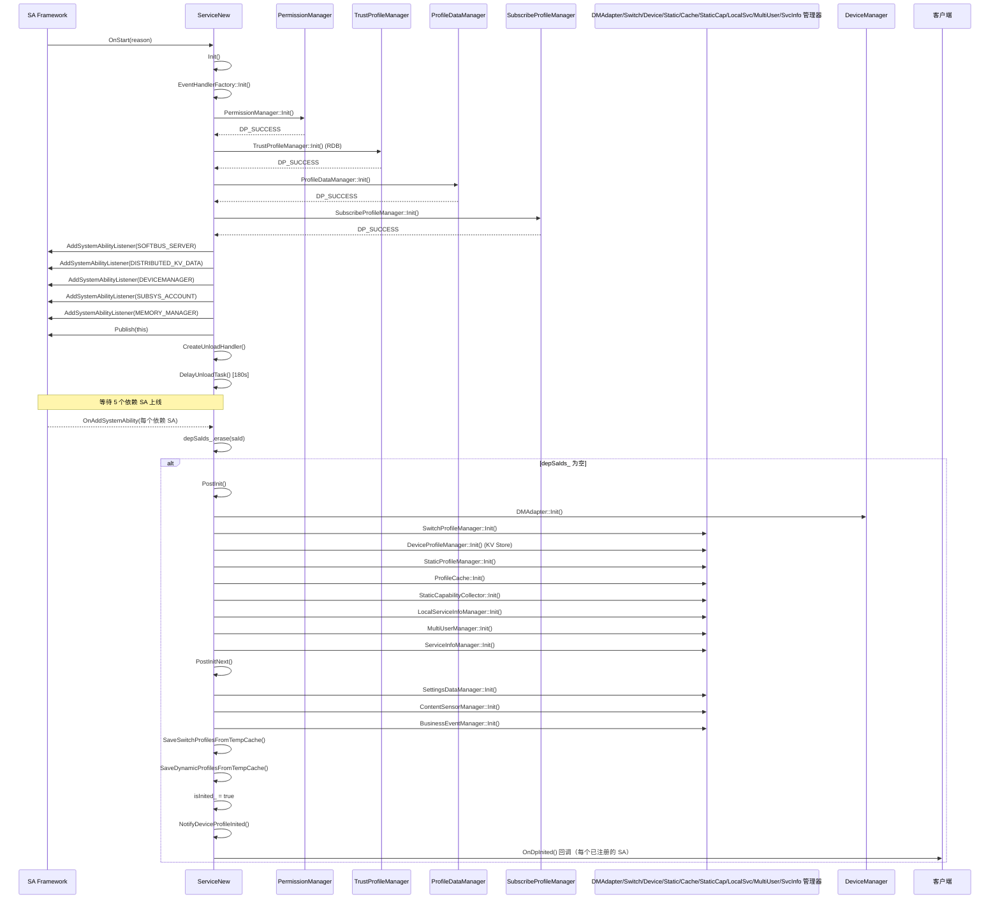

# 01 -- SA 服务生命周期

> 本节涵盖 DistributedDeviceProfileServiceNew（SAID 6001）的完整生命周期，从启动、初始化、空闲管理到关闭的全过程。
>
> 源代码：`services/core/src/distributed_device_profile_service_new.cpp`

---

## 1. 概述

本节说明 DeviceProfile 服务的整体生命周期。该服务是一个按需启动的 System Ability（SAID 6001，进程名 `deviceprofile`）。当设备上线事件或 `usual.event.BOOT_COMPLETED` 触发时启动，随后等待 5 个依赖 SA 就绪后才完成初始化。服务支持延迟卸载（180 秒保活）以及由内存管理器驱动的空闲/活跃状态切换。

**生命周期阶段：** OnStart --> Init --> 等待依赖 SA --> PostInit --> PostInitNext --> 运行中 --> OnIdle（空闲）--> OnActive（恢复）--> OnStop --> 已停止

---

## 2. 完整启动时序图

下图展示了从 SA Framework 调用 OnStart 到服务完全初始化并通知所有订阅者的完整启动流程。



关键步骤说明：
1. `OnStart` 被 SA Framework 调用后，服务首先初始化 4 个基础管理器（PermissionManager、TrustProfileManager、ProfileDataManager、SubscribeProfileManager）。
2. 随后注册 5 个依赖 SA 的监听器并发布自身，同时启动 180 秒延迟卸载定时器。
3. 每当一个依赖 SA 上线，`OnAddSystemAbility` 回调将其从 `depSaIds_` 集合中移除。
4. 当所有 5 个依赖 SA 全部就绪后，进入 `PostInit` 阶段，初始化剩余的 9 个管理器。
5. `PostInitNext` 完成最终初始化步骤，刷新临时缓存，并通知所有已订阅的客户端。

---

## 3. 状态机

下图展示了服务的完整状态机，包含从初始化到关闭的所有状态及转换触发条件。

```mermaid
stateDiagram
    [*] --> 未初始化
    未初始化 --> 初始化中 : OnStart
    初始化中 --> 等待依赖SA : Init() 成功
    等待依赖SA --> PostInit阶段 : 全部5个依赖SA上线
    PostInit阶段 --> 运行中 : PostInitNext() + NotifyInited
    运行中 --> 空闲 : OnIdle（低内存/超时）
    空闲 --> 运行中 : OnActive（唤醒）
    运行中 --> 停止中 : OnStop / 180s卸载超时
    停止中 --> 已停止 : UnInit() + UnInitNext()
    已停止 --> [*]

    note right of 等待依赖SA : 5个SA: SoftBus, KV, DM, Account, MemMgr
    note right of 空闲 : 180s保活定时器到期
    note right of 停止中 : 取消卸载定时器
```

---

## 4. 状态转换条件

| 当前状态 | 事件 | 下一状态 | 动作/条件 |
|---|---|---|---|
| Uninitialized --> Initializing | `OnStart(reason)` | SA framework 调用 SA 6001 |
| Initializing --> WaitingDependentSAs | `Init()` 返回 `DP_SUCCESS` | PermissionManager、TrustProfileManager、ProfileDataManager、SubscribeProfileManager 全部初始化成功 |
| WaitingDependentSAs --> PostInitPhase | 全部 5 个依赖 SA 的 `OnAddSystemAbility` 被调用 | SoftBus、KV Data、DeviceManager、Account、MemoryManager 全部上线 |
| PostInitPhase --> Running | `PostInitNext()` 返回 `DP_SUCCESS` | 缓存已刷新，ContentSensorManager 已启动，`NotifyDeviceProfileInited()` 已发送给所有订阅者 |
| Running --> Idle | `OnIdle(reason)` | 低内存原因（且 `IsReadyIntoIdle()` 返回 true）或其他空闲原因 |
| Idle --> Running | `OnActive(reason)` | SA 被重新激活（IPC 调用到达、设备上线） |
| Running --> Stopping | `OnStop()` 或 180s 定时器触发 | `DelayUnloadTask` 在 180s 后投递 `UnloadSystemAbility(6001)` |
| Stopping --> Stopped | `UnInit()` + `UnInitNext()` | 所有管理器按逆序反初始化，缓存清空 |

---

## 5. 延迟卸载机制（180 秒保活）

本节说明服务的按需生命周期机制。在发布自身后，服务立即调度一个卸载定时器，避免在空闲状态时无限期运行。

```text
OnStart() -->
  CreateUnloadHandler() -->
    DelayUnloadTask()
      --> unloadHandler_->PostTask(unloadTask, "unload_dp_svr", 180000ms)
      --> 定时器触发时: samgrProxy->UnloadSystemAbility(DISTRIBUTED_DEVICE_PROFILE_SA_ID)
```

**关键行为：**
- 定时器通过 `DELAY_TIME` 常量设置为 **180,000 ms（3 分钟）**。
- 当任何 IPC 调用到达时，检查 `IsReadyIntoIdle()` —— 如果有 IPC 正在运行（`runningIpcCount_ > 0`）或有设备在线，则拒绝进入空闲。
- `ExitIdleState()` 通过 `CancelIdle()` 显式取消失活定时器。
- `OnStop()` 调用 `DestroyUnloadHandler()` 移除已投递的卸载任务。
- 卸载任务 ID 为 `"unload_dp_svr"`；投递新的延迟任务会先移除之前挂起的任务。

**空闲进入守卫（`IsReadyIntoIdle`）：**
1. 如果 `runningIpcCount_ > 0`（有 IPC 正在执行），返回 false —— 拒绝空闲。
2. 如果 `ProfileCache::IsDeviceOnline()` 为 true（有设备已连接），返回 false —— 拒绝空闲。
3. 否则返回 true —— 允许进入空闲。

---

## 6. Init 和 PostInit 错误码

### Init() 错误码

| 步骤 | 管理器 | 错误码 | 触发条件 |
|---|---|---|---|
| 1 | EventHandlerFactory | 返回 `DP_SUCCESS`（硬编码） | 不会失败 |
| 2 | PermissionManager | 直接返回其 Init 结果 | 权限管理初始化失败 |
| 3 | TrustProfileManager | 记录日志，不阻塞流程（返回后继续执行） | RDB 初始化失败 |
| 4 | ProfileDataManager | 记录日志，不阻塞流程 | Profile 数据管理器初始化失败 |
| 5 | SubscribeProfileManager | 无错误返回（void Init） | 不会失败 |

### PostInit() 错误码

| 步骤 | 管理器 | 错误码 | 触发条件 |
|---|---|---|---|
| 1 | DMAdapter | `DP_DM_ADAPTER_INIT_FAIL` (98566252) | DM 适配器初始化失败 |
| 2 | SwitchProfileManager | `DP_DEVICE_PROFILE_MANAGER_INIT_FAIL` (98566176) | 开关 Profile 管理器初始化失败 |
| 3 | DeviceProfileManager | `DP_DEVICE_PROFILE_MANAGER_INIT_FAIL` (98566176) | 设备 Profile 管理器初始化失败 |
| 4 | StaticProfileManager | `DP_CONTENT_SENSOR_MANAGER_INIT_FAIL` (98566179) | 静态 Profile 管理器初始化失败 |
| 5 | ProfileCache | `DP_CACHE_INIT_FAIL` (98566173) | 缓存初始化失败 |
| 6 | StaticCapabilityCollector | `DP_CONTENT_SENSOR_MANAGER_INIT_FAIL` (98566179) | 静态能力收集器初始化失败 |
| 7 | LocalServiceInfoManager | `DP_LOCAL_SERVICE_INFO_MANAGER_INIT_FAIL` (98566329) | 本地服务信息管理器初始化失败 |
| 8 | MultiUserManager | `DP_MULTI_USER_MANAGER_INIT_FAIL` (98566281) | 多用户管理器初始化失败 |
| 9 | ServiceInfoManager | 记录日志，不阻塞返回 | 服务信息管理器初始化失败 |

### PostInitNext() 错误码

| 步骤 | 管理器 | 错误码 | 触发条件 |
|---|---|---|---|
| 1 | SettingsDataManager | `DP_SETTINGSDATA_MANAGER_INIT_FAIL` (98566309) | 设置数据管理器初始化失败 |
| 2 | ContentSensorManager | `DP_CONTENT_SENSOR_MANAGER_INIT_FAIL` (98566179) | 内容传感器管理器初始化失败 |
| 3 | BusinessEventManager | `DP_BUSINESS_EVENT_MANAGER_INIT_FAIL` (98566332) | 业务事件管理器初始化失败 |

### UnInit() 错误码

| 步骤 | 管理器 | 错误码 | 触发条件 |
|---|---|---|---|
| 1 | TrustProfileManager | `DP_TRUST_PROFILE_MANAGER_UNINIT_FAIL` (98566182) | 信任 Profile 管理器反初始化失败 |
| 2 | ProfileDataManager | `DP_PROFILE_DATA_MANAGER_UNINIT_FAIL` (98566311) | Profile 数据管理器反初始化失败 |
| 3 | SwitchProfileManager | `DP_DEVICE_PROFILE_MANAGER_UNINIT_FAIL` (98566183) | 开关 Profile 管理器反初始化失败 |
| 4 | DeviceProfileManager | `DP_DEVICE_PROFILE_MANAGER_UNINIT_FAIL` (98566183) | 设备 Profile 管理器反初始化失败 |
| 5 | StaticProfileManager | `DP_CONTENT_SENSOR_MANAGER_UNINIT_FAIL` (98566186) | 静态 Profile 管理器反初始化失败 |
| 6 | BusinessEventManager | `DP_BUSINESS_EVENT_MANAGER_UNINIT_FAIL` (98566333) | 业务事件管理器反初始化失败 |
| 7 | ProfileCache | `DP_CACHE_INIT_FAIL` (98566173) | 缓存反初始化失败 |
| 8 | PermissionManager | `DP_DEVICE_MANAGER_UNINIT_FAIL` (98566181) | 权限管理器反初始化失败 |
| 9 | SubscribeProfileManager | `DP_SUBSCRIBE_DEVICE_PROFILE_MANAGER_UNINIT_FAIL` (98566185) | 订阅 Profile 管理器反初始化失败 |
| 10 | StaticCapabilityCollector | `DP_CONTENT_SENSOR_MANAGER_UNINIT_FAIL` (98566186) | 静态能力收集器反初始化失败 |
| 11 | SettingsDataManager | `DP_SETTINGSDATA_MANAGER_UNINIT_FAIL` (98566310) | 设置数据管理器反初始化失败 |
| 12 | ContentSensorManager | `DP_CONTENT_SENSOR_MANAGER_UNINIT_FAIL` (98566186) | 内容传感器管理器反初始化失败 |
| 13 | DMAdapter | `DP_DM_ADAPTER_UNINIT_FAIL` (98566283) | DM 适配器反初始化失败 |
| 14 | EventHandlerFactory | `DP_CACHE_UNINIT_FAIL` (98566180) | 事件处理器工厂反初始化失败 |
| 15 | ServiceInfoManager | 记录日志，不阻塞流程 | 服务信息管理器反初始化失败 |

---

## 7. OnIdle / OnActive 行为

本节说明空闲/活跃状态切换的具体处理逻辑。

### OnIdle 处理流程
```
OnIdle(reason) -->
  如果 reason == "resourceschedule.memmgr.low.memory.prepare":
    返回 IsReadyIntoIdle() ? SA_READY_INTO_IDLE (0) : SA_REFUSE_INTO_IDLE (-1)
  否则:
    MemMgrClient::SetCritical(pid, false, KV_DATA_SA_ID)
    返回 SA_READY_INTO_IDLE (0)
```

当空闲原因为低内存准备时，服务检查是否存在运行中的 IPC 或在线设备；如果存在则拒绝空闲。其他空闲原因则降低 KV Data SA 的临界优先级并接受空闲。

### OnActive 处理流程
```
OnActive(reason) -->
  MemMgrClient::SetCritical(pid, true, DISTRIBUTED_DEVICE_PROFILE_SA_ID)
```

重新激活时将自身 SA 设为临界优先级。

### OnStop 处理流程
```
OnStop() -->
  isStopped_ = true
  UnInit()（所有管理器按逆序反初始化）
  MemMgrClient::SetCritical(pid, false, ...)
  MemMgrClient::NotifyProcessStatus(pid, 1, 0, DP_SA_ID)
```

---

## 8. OnAddSystemAbility：依赖 SA 追踪

本节说明 5 个依赖 SA 如何被追踪。它们通过 `depSaIds_`（SA ID 的 set 集合）进行管理。当每个 SA 上线时执行以下逻辑：

```text
OnAddSystemAbility(saId, deviceId) -->
  如果 saId == SUBSYS_ACCOUNT_SYS_ABILITY_ID_BEGIN:
    SubscribeAccountCommonEvent()  // 用户切换/移除
  如果 saId == MEMORY_MANAGER_SA_ID:
    MemMgrClient::NotifyProcessStatus(pid, 1, 1, DP_SA_ID)
    MemMgrClient::SetCritical(pid, true, DP_SA_ID)
  如果 IsInited(): 返回（已完成初始化）
  depSaIds_.erase(saId)
  如果 depSaIds_.empty():
    PostInit()  // 全部 5 个 SA 已上线，继续初始化
```

5 个依赖 SA ID：
1. `SOFTBUS_SERVER_SA_ID` —— SoftBus，用于设备发现
2. `DISTRIBUTED_KV_DATA_SERVICE_ABILITY_ID` —— KV Store，用于数据同步
3. `DISTRIBUTED_HARDWARE_DEVICEMANAGER_SA_ID` —— 设备管理器
4. `SUBSYS_ACCOUNT_SYS_ABILITY_ID_BEGIN` —— 账户子系统（用户管理）
5. `MEMORY_MANAGER_SA_ID` —— 内存管理器（空闲/活跃控制）

---

## 9. 账户事件处理

账户 SA 上线后，服务订阅两个通用事件：

| 事件 | 处理器 | 动作 |
|---|---|---|
| `COMMON_EVENT_USER_SWITCHED` | `MultiUserManager::SetCurrentForegroundUserID(userId)` + `ContentSensorManager::Init()` | 更新当前前台用户 ID 并重新初始化内容传感器管理器 |
| `COMMON_EVENT_USER_REMOVED` | `DeviceProfileManager::DeleteRemovedUserData(userId)` | 删除被移除用户的所有数据 |

---

## 10. 临时缓存：填补首次初始化数据间隙

本节说明在 `OnStart` 和 `PostInitNext` 之间的时间窗口内，客户端可以调用 Put API 但 KV Store 可能尚未就绪。为此服务使用临时缓存机制：

- **`dynamicProfileMap_`**：持有 Device/Service/Characteristic Profile 条目（键值对）
- **`switchProfileMap_`**：持有 SWITCH_STATUS 类型的 CharacteristicProfile 对象

在 `PostInitNext()` 中，这些缓存被刷新：
1. `SaveSwitchProfilesFromTempCache()` —— 通过 `SwitchProfileManager::PutCharacteristicProfileBatch` 写入开关 Profile
2. `SaveDynamicProfilesFromTempCache()` —— 通过 `DeviceProfileManager::SavePutTempCache` 写入 KV Store

如果首次初始化数据库为空，服务最多等待 5 秒（`WAIT_BUSINESS_PUT_TIME_S`）并在最多 20 次重试（`WRTE_CACHE_PROFILE_RETRY_TIMES`）中刷新缓存，每次重试间隔 200ms。

---

## 11. 关键代码路径

| 操作 | 入口函数 | 源文件 | 行号 |
|---|---|---|---|
| OnStart 入口 | `distributed_device_profile_service_new.cpp` | 912 |
| Init() | `distributed_device_profile_service_new.cpp` | 86 |
| AddSystemAbilityListener (x5) | `distributed_device_profile_service_new.cpp` | 924-928 |
| Publish + DelayUnload | `distributed_device_profile_service_new.cpp` | 931-938 |
| OnAddSystemAbility | `distributed_device_profile_service_new.cpp` | 972 |
| PostInit() | `distributed_device_profile_service_new.cpp` | 106 |
| PostInitNext() | `distributed_device_profile_service_new.cpp` | 151 |
| SaveDynamicProfilesFromTempCache | `distributed_device_profile_service_new.cpp` | 1153 |
| NotifyDeviceProfileInited | `distributed_device_profile_service_new.cpp` | 1286 |
| OnStop() | `distributed_device_profile_service_new.cpp` | 941 |
| UnInit() | `distributed_device_profile_service_new.cpp` | 208 |
| UnInitNext() | `distributed_device_profile_service_new.cpp` | 262 |
| DelayUnloadTask | `distributed_device_profile_service_new.cpp` | 883 |
| CreateUnloadHandler | `distributed_device_profile_service_new.cpp` | 302 |
| DestroyUnloadHandler | `distributed_device_profile_service_new.cpp` | 316 |
| OnIdle | `distributed_device_profile_service_new.cpp` | 959 |
| OnActive | `distributed_device_profile_service_new.cpp` | 952 |
| IsReadyIntoIdle | `distributed_device_profile_service_new.cpp` | 183 |
| AccountCommonEventCallback | `distributed_device_profile_service_new.cpp` | 1020 |
| AddSvrProfilesToCache | `distributed_device_profile_service_new.cpp` | 1045 |
| AddCharProfilesToCache | `distributed_device_profile_service_new.cpp` | 1071 |
| ClearProfileCache | `distributed_device_profile_service_new.cpp` | 1182 |
