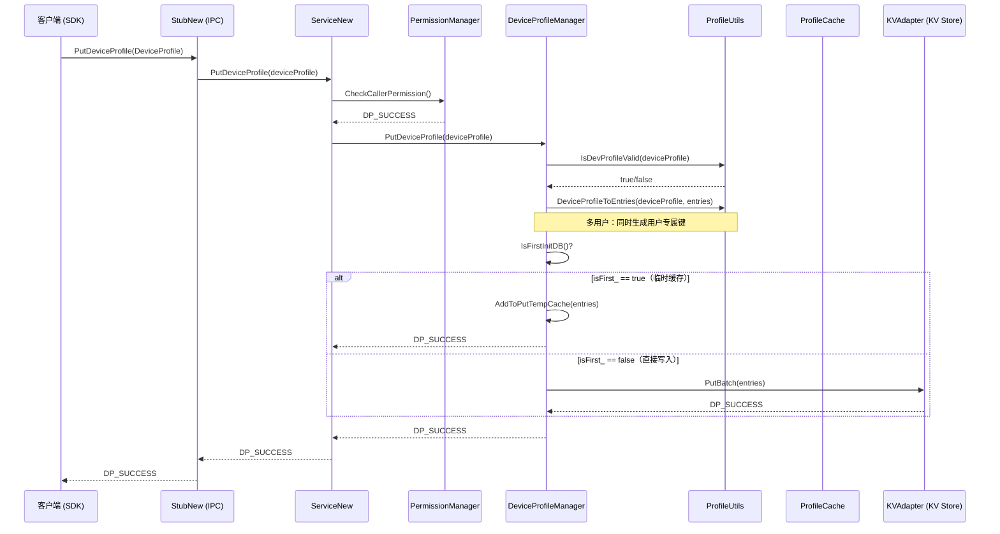
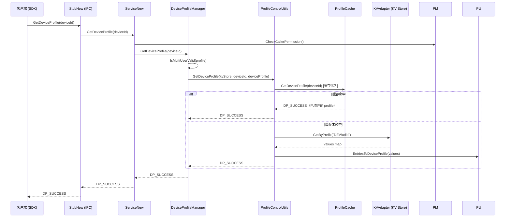
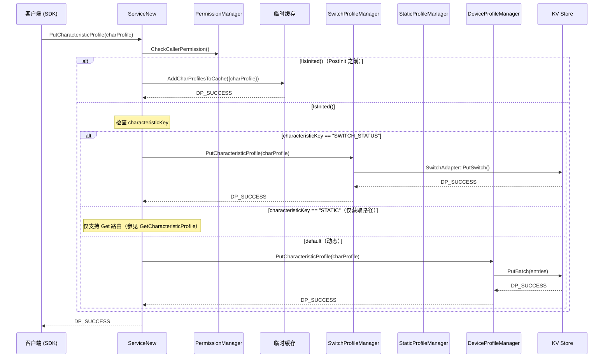
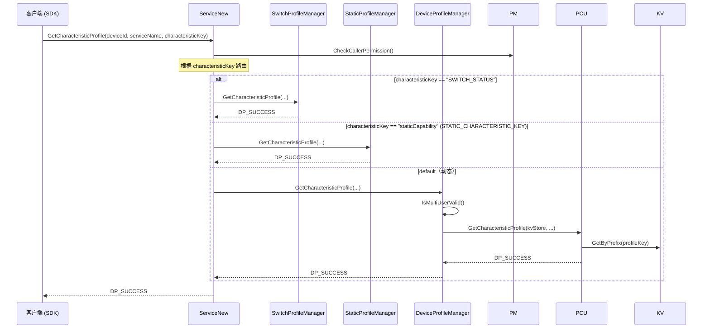

# 02 -- Profile CRUD 操作

> 本节涵盖 DeviceProfile、ServiceProfile 和 CharacteristicProfile 三种 Profile 类型的增删改查操作。
>
> 主要源代码：`services/core/src/deviceprofilemanager/device_profile_manager.cpp`、`services/core/src/utils/profile_control_utils.cpp`

---

## 1. 概述

本节说明 DeviceProfile 模块为三种 Profile 类型提供的 CRUD 操作能力。所有数据存储在分布式 KV Store 中（通过 `KVAdapter` 访问，底层由 `distributeddata_inner` 支撑）。服务层（`ServiceNew`）负责权限检查、CharacteristicProfile 路由分发，以及首次初始化时间窗口内的临时缓存逻辑。

**存储方式：** KV Store，键前缀方案：`DEV_PREFIX/udid/...`、`SVR_PREFIX/udid/...`、`CHAR_PREFIX/udid/...`

**缓存机制：** `ProfileCache`（内存单例）作为读穿透缓存和存在性检查器。

---

## 2. PutDeviceProfile 时序图

下图展示了客户端写入设备 Profile 的完整调用链，包括权限校验、合法性验证、序列化以及首次初始化时的临时缓存路径。



关键步骤说明：
1. 服务层首先通过 `PermissionManager` 验证调用方权限。
2. `ProfileUtils::IsDevProfileValid` 校验 Profile 字段合法性。
3. `DeviceProfileToEntries` 将 Profile 对象序列化为 KV 键值对；对于多用户 Profile，同时生成用户专属键和默认键。
4. 如果是首次初始化（`isFirst_ == true`），数据写入临时缓存 `putTempCache_`，待后续 `PostInitNext` 时统一刷新。

---

## 3. GetDeviceProfile 时序图（缓存优先）

下图展示了设备 Profile 的读取流程，遵循缓存优先策略：先查内存缓存，未命中再回源 KV Store。



---

## 4. PutCharacteristicProfile 路由时序图

下图展示了 CharacteristicProfile 写入时的路由分发逻辑：根据 `characteristicKey` 将请求分发到 SwitchProfileManager、StaticProfileManager 或 DeviceProfileManager。



关键步骤说明：
1. 在服务未完成初始化（`!IsInited()`）时，CharacteristicProfile 直接写入服务层临时缓存，等待 `PostInitNext` 统一刷新。
2. 服务初始化完成后，根据 `characteristicKey` 进行路由分发：
   - `"SWITCH_STATUS"` 路由到 `SwitchProfileManager`，通过 `SwitchAdapter` 写入 KV Store。
   - `"staticCapability"`（`STATIC_CHARACTERISTIC_KEY`）仅支持获取路径，写入走默认动态路径。
   - 其他任意 Key 路由到 `DeviceProfileManager`，通过 KV Store 的 `PutBatch` 写入。

---

## 5. GetCharacteristicProfile 路由时序图

下图展示了 CharacteristicProfile 读取时的路由分发逻辑。



---

## 6. CharacteristicProfile 路由表

| CharacteristicKey | Put 管理器 | Get 管理器 | Delete 管理器 | 存储后端 |
|---|---|---|---|---|
| `"SWITCH_STATUS"`（编译期守卫：`DEVICE_PROFILE_SWITCH_DISABLE`） | SwitchProfileManager | SwitchProfileManager | （不在服务层路由） | SwitchAdapter（KV Store + 位掩码） |
| `"staticCapability"` (`STATIC_CHARACTERISTIC_KEY`) | DeviceProfileManager (KV) | StaticProfileManager | DeviceProfileManager (KV) | KV Store |
| 其他任意 Key（动态） | DeviceProfileManager | DeviceProfileManager | DeviceProfileManager | KV Store |

`PutCharacteristicProfileBatch` 将批量数据拆分为两个向量：`switchCharProfiles`（SWITCH_STATUS 键）和 `dynamicCharProfiles`（其他所有键）。每个向量由各自对应的管理器处理。

---

## 7. 缓存优先的读取路径

本节说明 `ProfileControlUtils` 中所有 Get 操作遵循的缓存优先模式：

```
1. 校验 kvStore 指针和输入键的合法性
2. 尝试 ProfileCache::GetXXXProfile() [内存缓存]
3. 如果缓存命中：立即返回 DP_SUCCESS
4. 如果缓存未命中：KVAdapter::GetByPrefix(keyPrefix)
5. 通过 ProfileUtils 将条目反序列化为 Profile 对象
6. 校验反序列化后的 Profile 合法性
7. 返回 DP_SUCCESS
```

对于 CharacteristicProfile，还有一个额外的 OH 后缀回退机制：如果直接键查找失败，代码会通过 `CheckAndAddOhSuffix` 在服务名后追加 `_oh` 后缀后重试。

---

## 8. 多用户键生成与校验

### 键生成

当 Profile 的 `isMultiUser = true` 时，会生成两组 KV 键：

1. **用户专属键**：`PREFIX/udid/serviceName/charKey/OH_USER/userId` —— 用于按用户隔离数据
2. **默认键**：`PREFIX/udid/serviceName/charKey` —— 用于当前前台用户

用户专属键的路径中包含 `OH_USER`。写入操作同时生成两组键；读取时通过 `IsMultiUserValid` 检查确保请求用户匹配前台用户。

### 多用户校验规则

```text
IsMultiUserValid(profile):
  1. deviceId 不能为空
  2. 如果 isMultiUser：userId 必须 > 0
  3. 如果 !isMultiUser：userId 必须 == DEFAULT_USER_ID
  4. 如果 isMultiUser 且 deviceId == localUdid 且 userId != foregroundUserId：
       --> DP_GET_LOCAL_PROFILE_IS_NOT_FOREGROUND_ID (98566279)
  否则: DP_SUCCESS
```

当用户被移除时（`COMMON_EVENT_USER_REMOVED`），`DeleteRemovedUserData(userId)` 扫描所有本地 KV 条目，删除键中包含被移除用户 ID 的条目。

---

## 9. 删除约束

**仅本地设备 Profile 可被删除** —— 由 `ProfileControlUtils::DeleteServiceProfile` 和 `DeleteCharacteristicProfile` 强制约束：

```cpp
if (!ProfileUtils::IsKeyValid(deviceId) || !ProfileUtils::IsLocalUdid(deviceId) || ...) {
    return DP_INVALID_PARAMS;  // 98566245
}
```

`IsLocalUdid` 检查确保目标 deviceId 与本地设备的 UDID 匹配。远程设备 Profile 不能通过这些 API 删除。

删除操作同时触发缓存失效：
```cpp
ProfileCache::GetInstance().DeleteServiceProfile(deviceId, serviceName);
ProfileCache::GetInstance().DeleteCharProfile(deviceId, serviceName, characteristicKey);
```

---

## 10. 临时缓存机制（首次初始化数据间隙）

**问题背景：** 在 `OnStart` 和 `PostInitNext` 之间，KV Store 可能尚未就绪，但客户端仍可调用 Put API。在此窗口期内写入的数据会丢失。

**解决方案：** 两级临时缓存系统：

### 第一级：服务层临时缓存
- `dynamicProfileMap_`（map<string, string>）—— 持有 Device/Service/Characteristic Profile 的 KV 条目
- `switchProfileMap_`（map<string, CharacteristicProfile>）—— 持有 SWITCH_STATUS 类型的 Profile
- 当 `!IsInited()` 时，由 `AddSvrProfilesToCache()` 和 `AddCharProfilesToCache()` 填充

### 第二级：DeviceProfileManager 层临时缓存
- `putTempCache_`（map<string, string>）—— 当 `isFirst_ == true`（首次数据库初始化）时持有条目
- 由每个 Put 方法中的 `AddToPutTempCache()` 填充

### 刷新顺序（在 PostInitNext 中执行）：
1. `SaveSwitchProfilesFromTempCache()` —— 通过 SwitchProfileManager 写入开关 Profile
2. `SaveDynamicProfilesFromTempCache()`：
   - 将 `putTempCache_` 与业务条目合并
   - 如果所有条目为空且 `IsFirstInitDB()` 为 true，等待 5 秒后重新获取
   - 尝试 `deviceProfileStore_->PutBatch(entries)` 最多 20 次，每次重试间隔 200ms
   - 全部重试失败后：调用 `ResetFirst()` 清除首次初始化标志

---

## 11. Profile 校验规则

| Profile 类型 | 校验方法 | 关键检查项 |
|---|---|---|
| DeviceProfile | `ProfileUtils::IsDevProfileValid` | DeviceId 非空、deviceIdType 合法、deviceName 非空 |
| ServiceProfile | `ProfileUtils::IsSvrProfileValid` | DeviceId 非空、serviceName 非空、serviceType 非空 |
| CharacteristicProfile | `ProfileUtils::IsCharProfileValid` | DeviceId 非空、serviceName 非空、characteristicKey 非空、characteristicValue 非空 |

写入缓存前，还会执行额外的存在性检查：
```cpp
ProfileCache::GetInstance().IsXXXProfileExist(profile)
```

如果 Profile 已存在于缓存中，返回 `DP_CACHE_EXIST` (98566164)。

---

## 12. 错误码参考

| 错误码 | 值 | 含义 |
|---|---|---|
| `DP_SUCCESS` | 0 | 操作成功 |
| `DP_INVALID_PARAMS` | 98566144 | 参数无效（通用） |
| `DP_INVALID_PARAM` | 98566245 | 参数无效 |
| `DP_PERMISSION_DENIED` | 98566155 | 调用方缺少权限 |
| `DP_KV_DB_PTR_NULL` | 98566189 | KV Store 指针为空 |
| `DP_PUT_KV_DB_FAIL` | 98566197 | KV PutBatch 失败 |
| `DP_DEL_KV_DB_FAIL` | 98566198 | KV DeleteBatch 失败 |
| `DP_GET_KV_DB_FAIL` | 98566199 | KV GetByPrefix/Get 失败 |
| `DP_CACHE_EXIST` | 98566164 | Profile 已存在于缓存中 |
| `DP_DEVICE_UNSUPPORTED_SWITCH` | 98566338 | 当前设备不支持开关数据 |
| `DP_PUT_CHAR_BATCH_FAIL` | 98566264 | PutCharacteristicProfileBatch 部分失败 |
| `DP_GET_MULTI_USER_PROFILE_PARAMS_INVALID` | 98566278 | 多用户参数无效 |
| `DP_GET_LOCAL_PROFILE_IS_NOT_FOREGROUND_ID` | 98566279 | 本地 Profile userId 不等于前台 userId |
| `DP_GET_LOCAL_UDID_FAILED` | 98566146 | 获取本地 UDID 失败 |

---

## 13. 关键代码路径

| 操作 | 入口函数 | 源文件 | 行号 |
|---|---|---|---|
| PutDeviceProfile 入口（服务层） | `distributed_device_profile_service_new.cpp` | 510 |
| PutServiceProfile 入口（服务层） | `distributed_device_profile_service_new.cpp` | 521 |
| PutCharacteristicProfile 入口（服务层） | `distributed_device_profile_service_new.cpp` | 557 |
| PutCharacteristicProfileBatch（服务层） | `distributed_device_profile_service_new.cpp` | 585 |
| GetDeviceProfile 入口（服务层） | `distributed_device_profile_service_new.cpp` | 655 |
| GetCharacteristicProfile 入口（服务层） | `distributed_device_profile_service_new.cpp` | 692 |
| DPM::PutDeviceProfile | `device_profile_manager.cpp` | 109 |
| DPM::PutServiceProfile | `device_profile_manager.cpp` | 146 |
| DPM::PutCharacteristicProfile | `device_profile_manager.cpp` | 222 |
| DPM::GetDeviceProfile | `device_profile_manager.cpp` | 298 |
| DPM::Init（KV Store 创建） | `device_profile_manager.cpp` | 54 |
| DPM::SavePutTempCache | `device_profile_manager.cpp` | 705 |
| DPM::IsFirstInitDB | `device_profile_manager.cpp` | 748 |
| DPM::AddToPutTempCache | `device_profile_manager.cpp` | 686 |
| PCU::PutDeviceProfile | `profile_control_utils.cpp` | 33 |
| PCU::GetDeviceProfile | `profile_control_utils.cpp` | 224 |
| PCU::GetServiceProfile | `profile_control_utils.cpp` | 256 |
| PCU::GetCharacteristicProfile | `profile_control_utils.cpp` | 289 |
| PCU::DeleteServiceProfile | `profile_control_utils.cpp` | 422 |
| PCU::DeleteCharacteristicProfile | `profile_control_utils.cpp` | 456 |
| DPM::IsMultiUserValid | `device_profile_manager.cpp` | 1125 |
