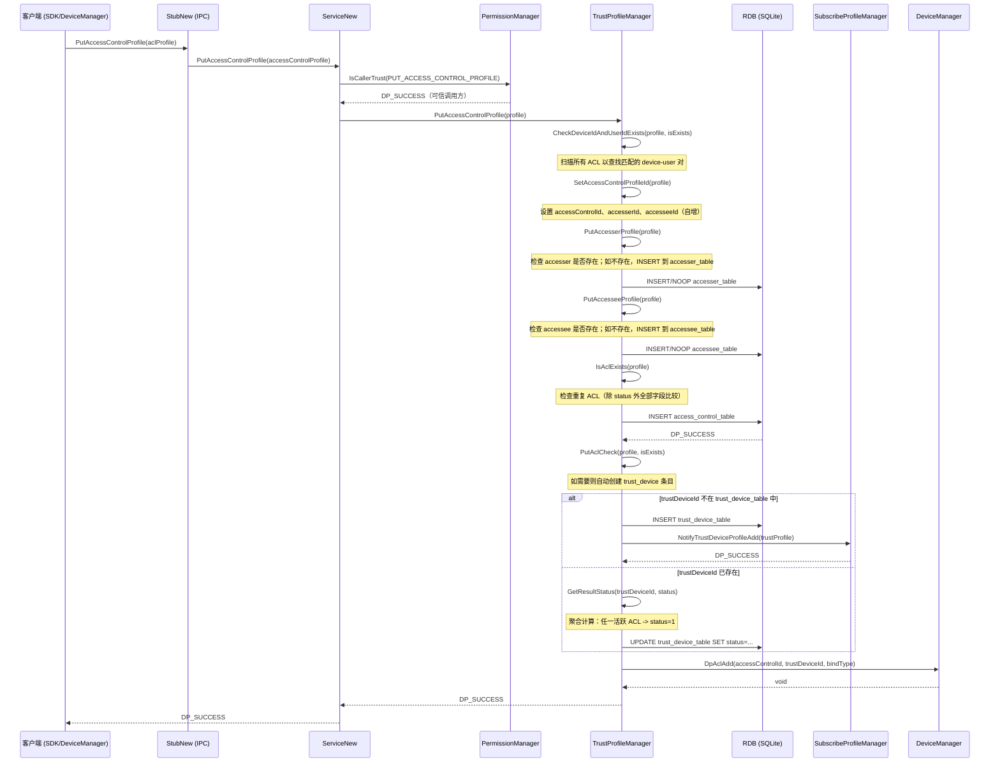
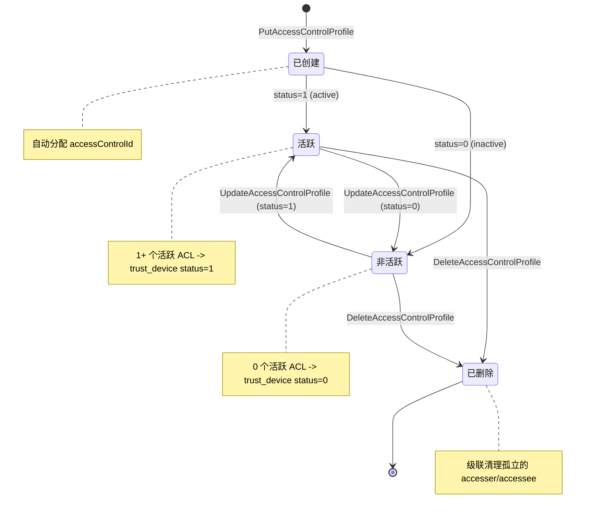
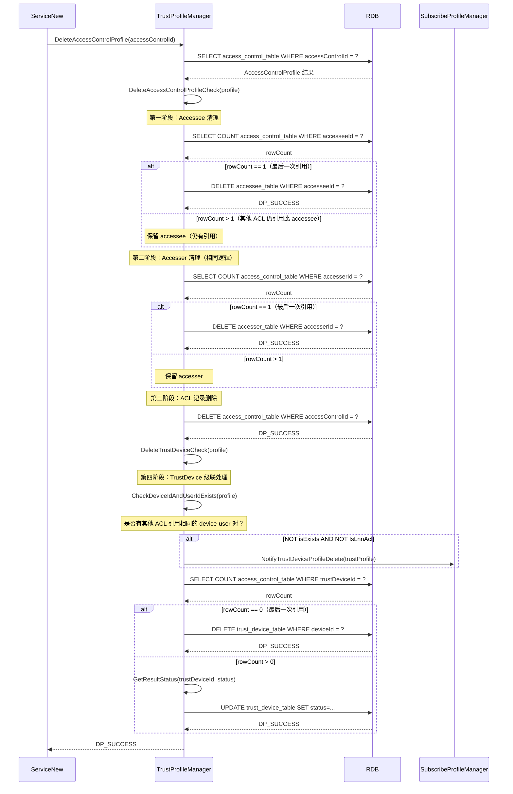

# 03 -- Trust 与 ACL 管理

> 本节涵盖 AccessControlProfile 和 TrustDeviceProfile 的增删改查操作，包括四表数据库模型、级联效应、LNN ACL 过滤以及双向查询路由。
>
> 主要源代码：`services/core/src/trustprofilemanager/trust_profile_manager.cpp`

---

## 1. 概述

本节说明 TrustProfileManager 如何管理设备之间的信任关系。数据存储在本地 RDB（SQLite，通过 `native_rdb` 访问）中。数据模型由 4 张表组成，分别表示访问控制关系的不同侧面：`accesser_table`、`accessee_table`、`access_control_table` 和 `trust_device_table`。

**核心概念：**
- **Accesser（授权方）**：信任关系的发起方（谁在授予访问权限）
- **Accessee（被授权方）**：信任关系的接收方（谁在接收访问权限）
- **ACL**：授权方与被授权方之间的绑定关系，由 `accessControlId` 标识
- **TrustDevice（信任设备）**：至少有一个 ACL 引用它的设备
- **LNN ACL**：自动协商的局域网 ACL（通过 `extraData` JSON 字段标识），在大多数面向用户的查询结果中被过滤掉

---

## 2. PutAccessControlProfile 完整时序图

下图展示了创建一条访问控制 Profile 的完整流程，包括 accesser/accessee 的首次创建、ACL 重复检测、trust_device 自动创建或状态更新，以及 DeviceManager 通知。



关键步骤说明：
1. `SetAccessControlProfileId` 为 ACL、accesser 和 accessee 自动分配自增 ID。
2. `PutAccesserProfile` 和 `PutAccesseeProfile` 采用"存在即复用、不存在则创建"的策略。
3. `IsAclExists` 检查是否存在除 `status` 外字段完全相同的重复 ACL。
4. `PutAclCheck` 负责 trust_device 的级联维护：如果该设备的 trust_device 条目不存在则自动创建并发送通知；如果已存在则重新计算聚合状态。
5. 创建成功后通过 `DpAclAdd` 通知 DeviceManager。

---

## 3. ACL 生命周期状态机

下图展示了 ACL 从创建到删除的完整状态机，以及每次状态变更对 trust_device 聚合状态的影响。



### 状态变更对 TrustDevice 的影响

- **已创建 / 活跃**：如果 trust_device 不存在，则自动创建。状态由 `GetResultStatus` 计算得出（统计该设备的活跃 ACL 数量）。
- **活跃 --> 活跃通知**：当某 device-user 对的**第一条** ACL 从非活跃转为活跃时，触发 `NotifyTrustDeviceProfileActive`。
- **活跃 --> 非活跃通知**：当某 device-user 对的**最后一条**活跃 ACL 转为非活跃时，触发 `NotifyTrustDeviceProfileInactive`。
- **已删除**：如果没有其他 ACL 引用同一个 trust_device，则删除 trust_device 并触发 `NotifyTrustDeviceProfileDelete`。否则重新计算 trust_device 状态。

---

## 4. DeleteAccessControlProfile 及级联删除

下图展示了删除 ACL 时的四级级联清理流程：Accessee 清理、Accesser 清理、ACL 记录删除、TrustDevice 级联更新/删除。



关键步骤说明：
1. 删除分段进行：先清理可能孤立的 accessee，再清理可能孤立的 accesser，最后删除 ACL 记录本身。
2. 每一级的清理都通过 `COUNT` 查询判断是否为最后一条引用——只有当 `rowCount == 1` 时才删除。
3. `DeleteTrustDeviceCheck` 在 ACL 删除后执行：如果该设备不再有任何 ACL 引用，则删除 trust_device 条目；否则重新计算其聚合状态。

---

## 5. 双向 ACL 查询路由

`GetAccessControlProfile(params)` 方法通过 `map<string, string>` 参数集支持灵活查询。路由逻辑将请求分发到正确的重载查询方法：

### 查询参数分发表

| 必需参数 | 可选参数 | 路由目标 |
|---|---|---|
| `trustDeviceId`、`status`、`userId`、`bundleName` | -- | `GetAccessControlProfile(userId, bundleName, trustDeviceId, status)` |
| `trustDeviceId`、`status`、`bundleName` | -- | `GetAccessControlProfile(bundleName, trustDeviceId, status)` |
| `trustDeviceId`、`status`、`tokenId` | -- | `GetAccessControlProfileByTokenId(tokenId, trustDeviceId, status)` |
| `bindType`、`status`、`userId`、`bundleName` | -- | `GetAccessControlProfile(userId, bundleName, bindType, status)` |
| `bindType`、`status`、`bundleName` | -- | `GetAccessControlProfile(bundleName, bindType, status)` |
| `userId`、`accountId` | -- | `GetAccessControlProfile(userId, accountId)` |
| 仅 `userId` | -- | `GetAccessControlProfile(userId)`（用户的所有 ACL） |
| `accesserDeviceId`、`accesseeDeviceId`、`accesserUserId`、`accesserAccountId`、`accesserTokenId` | `accesseeUserId`、`accesseeAccountId`、`accesseeTokenId` | `QueryType::ACER_AND_ACEE_TOKENID` 或 `QueryType::ACER_TOKENID`（双向） |

### 双向匹配逻辑

对于 `QueryType::ACER_TOKENID` 和 `QueryType::ACER_AND_ACEE_TOKENID`，查询同时支持正向和逆向匹配：

- **正向**：`accesser.deviceId == query.accesserDeviceId AND accessee.deviceId == query.accesseeDeviceId`
- **逆向**：`accesser.deviceId == query.accesseeDeviceId AND accessee.deviceId == query.accesserDeviceId`

两个方向都会被检查，匹配的 ACL 都包含在结果中。匹配还会校验用户 ID、账户 ID（针对 `SAME_ACCOUNT` 绑定类型）、Token ID 以及 `BindLevel::USER` 级别的匹配。

---

## 6. LNN ACL 过滤逻辑

LNN（Local Network Negotiation，本地网络协商）ACL 是自动发现的局域网级访问控制条目。它们**始终被过滤掉**，不出现在面向用户的查询结果中（`GetAllAclIncludeLnnAcl` 除外）。

### 通过 extraData JSON 解析进行检测

```cpp
bool IsLnnAcl(const AccessControlProfile& aclProfile) {
    cJSON* json = cJSON_Parse(aclProfile.GetExtraData().c_str());
    cJSON* item = cJSON_GetObjectItemCaseSensitive(json, "IS_LNN_ACL");
    if (item && cJSON_IsString(item)) {
        return (item->valuestring == "true");
    }
    return false;
}
```

### 所有查询结果集都经过 `RemoveLnnAcl` 处理：

```cpp
void RemoveLnnAcl(vector<AccessControlProfile>& profiles) {
    // 过滤掉所有 IsLnnAcl() 返回 true 的 profile
    // 被以下方法调用：GetAccessControlProfile（所有重载）、
    //               GetAllAccessControlProfile、GetAllAccessControlProfiles
}
```

**例外：** `GetAllAclIncludeLnnAcl()` 返回所有 ACL（包括 LNN 条目）—— 用于内部同步/修复操作。

---

## 7. TrustDevice 的 ACL 状态聚合

`GetResultStatus(trustDeviceId, status)` 方法计算 TrustDevice 的聚合状态：

```
1. SELECT * FROM access_control_table WHERE trustDeviceId = ?
2. 遍历所有匹配的 ACL
3. 如果任意 ACL 的 status == 1（活跃）：trustDeviceStatus = 1
4. 否则：trustDeviceStatus = 0（非活跃或无 ACL）
```

每次 ACL 被创建、更新或删除时，此聚合状态都会被写入 `trust_device_table.status`。

---

## 8. 数据库 Schema（4 张表）

### trust_device_table

| 列名 | 类型 | 键 | 说明 |
|---|---|---|---|
| `deviceId` | TEXT | PRIMARY KEY | 信任设备标识符（UDID） |
| `deviceIdType` | INTEGER | -- | 设备 ID 类型 |
| `deviceIdHash` | TEXT | -- | 设备 ID 哈希值 |
| `status` | INTEGER | -- | 聚合状态（0=非活跃，1=活跃） |

### access_control_table

| 列名 | 类型 | 键 | 说明 |
|---|---|---|---|
| `accessControlId` | INTEGER | PRIMARY KEY | 自增 ACL ID |
| `accesserId` | INTEGER | FK -> accesser_table | 引用 accesser |
| `accesseeId` | INTEGER | FK -> accessee_table | 引用 accessee |
| `trustDeviceId` | TEXT | FK -> trust_device_table | 对端设备 ID |
| `sessionKey` | TEXT | -- | 会话密钥 |
| `bindType` | INTEGER | -- | 绑定类型：SAME_ACCOUNT、POINT_TO_POINT 等 |
| `authenticationType` | INTEGER | -- | 认证类型 |
| `deviceIdType` | INTEGER | -- | 设备 ID 类型 |
| `deviceIdHash` | TEXT | -- | 设备 ID 哈希值 |
| `status` | INTEGER | -- | 0=非活跃，1=活跃 |
| `validPeriod` | INTEGER | -- | 有效期 |
| `lastAuthTime` | INTEGER | -- | 最后认证时间戳 |
| `bindLevel` | INTEGER | -- | 绑定级别：USER、DEVICE 等 |
| `extraData` | TEXT | -- | JSON 数据块（包含 LNN ACL 标志） |

### accesser_table

| 列名 | 类型 | 键 | 说明 |
|---|---|---|---|
| `accesserId` | INTEGER | PRIMARY KEY | 自增 accesser ID |
| `accesserDeviceId` | TEXT | -- | 授权方设备标识符 |
| `accesserUserId` | INTEGER | -- | 授权方用户 ID |
| `accesserAccountId` | TEXT | -- | 账户 ID |
| `accesserTokenId` | INTEGER | -- | Token ID |
| `accesserBundleName` | TEXT | -- | Bundle 名称 |
| `accesserHapSignature` | TEXT | -- | HAP 签名 |
| `accesserBindLevel` | INTEGER | -- | 绑定级别 |
| `accesserDeviceName` | TEXT | -- | 设备名称 |
| `accesserServiceName` | TEXT | -- | 服务名称 |
| `accesserCredentialId` | INTEGER | -- | 凭证 ID（整数） |
| `accesserCredentialIdStr` | TEXT | -- | 凭证 ID（字符串） |
| `accesserStatus` | INTEGER | -- | Accesser 状态 |
| `accesserSessionKeyId` | INTEGER | -- | 会话密钥 ID |
| `accesserSKTimeStamp` | INTEGER | -- | 会话密钥时间戳 |
| `accesserExtraData` | TEXT | -- | 扩展数据 |

### accessee_table

| 列名 | 类型 | 键 | 说明 |
|---|---|---|---|
| `accesseeId` | INTEGER | PRIMARY KEY | 自增 accessee ID |
| `accesseeDeviceId` | TEXT | -- | 被授权方设备标识符 |
| `accesseeUserId` | INTEGER | -- | 被授权方用户 ID |
| `accesseeAccountId` | TEXT | -- | 账户 ID |
| `accesseeTokenId` | INTEGER | -- | Token ID |
| `accesseeBundleName` | TEXT | -- | Bundle 名称 |
| `accesseeHapSignature` | TEXT | -- | HAP 签名 |
| `accesseeBindLevel` | INTEGER | -- | 绑定级别 |
| `accesseeDeviceName` | TEXT | -- | 设备名称 |
| `accesseeServiceName` | TEXT | -- | 服务名称 |
| `accesseeCredentialId` | INTEGER | -- | 凭证 ID（整数） |
| `accesseeCredentialIdStr` | TEXT | -- | 凭证 ID（字符串） |
| `accesseeStatus` | INTEGER | -- | Accessee 状态 |
| `accesseeSessionKeyId` | INTEGER | -- | 会话密钥 ID |
| `accesseeSKTimeStamp` | INTEGER | -- | 会话密钥时间戳 |
| `accesseeExtraData` | TEXT | -- | 扩展数据 |

### 表关系

```
accesser_table (1) --< (N) access_control_table (N) >-- (1) accessee_table
                                    |
                                    | trustDeviceId
                                    v
                            trust_device_table (1)
```

- 一个 accesser/accessee 可被多条 ACL 引用
- 一个 trust_device 可被多条 ACL 引用
- 删除 ACL 会级联清理孤立的 accesser/accessee/trust_device 条目

---

## 9. Update Access Control Profile 约束

更新 ACL 时，以下字段**不允许**修改（由 `UpdateAclCheck` 强制约束）：

- `accesserId`（必须与现有值一致）
- `accesseeId`（必须与现有值一致）
- `accesser.GetAccesserId()`（必须匹配 accesserId）
- `accessee.GetAccesseeId()`（必须匹配 accesseeId）

试图修改上述任意字段将返回 `DP_UPDATE_ACL_NOT_ALLOW` (98566249)。

允许更新的字段包括：`status`、`sessionKey`、`bindType`、`authenticationType`、`validPeriod`、`lastAuthTime`、`bindLevel`、`extraData`，以及所有 accesser/accessee 的详细信息字段（bundleName、hapSignature、deviceName、serviceName、credential ID 等）。

---

## 10. 错误码参考

| 错误码 | 值 | 触发条件 |
|---|---|---|
| `DP_SUCCESS` | 0 | 操作成功 |
| `DP_PERMISSION_DENIED` | 98566155 | 调用方缺少 trust 权限 |
| `DP_INVALID_PARAMS` | 98566144 | 参数无效（例如字符串过长） |
| `DP_INIT_DB_FAILED` | 98566148 | RDB 初始化失败 |
| `DP_GET_RDBSTORE_FAIL` | 98566214 | RDB Store 指针为空 |
| `DP_GET_RESULTSET_FAIL` | 98566220 | 结果集查询失败 |
| `DP_NOT_FIND_DATA` | 98566221 | 未找到匹配数据 |
| `DP_CREATE_TABLE_FAIL` | 98566226 | 创建表失败 |
| `DP_CREATE_UNIQUE_INDEX_FAIL` | 98566227 | 创建索引失败 |
| `DP_PUT_ACL_PROFILE_FAIL` | 98566170 | 插入 access_control_table 失败 |
| `DP_PUT_TRUST_DEVICE_PROFILE_FAIL` | 98566218 | 插入 trust_device_table 失败 |
| `DP_PUT_ACCESSER_PROFILE_FAIL` | 98566228 | 插入 accesser_table 失败 |
| `DP_PUT_ACCESSEE_PROFILE_FAIL` | 98566229 | 插入 accessee_table 失败 |
| `DP_UPDATE_ACL_PROFILE_FAIL` | 98566171 | 更新 access_control_table 失败 |
| `DP_UPDATE_TRUST_DEVICE_PROFILE_FAIL` | 98566230 | 更新 trust_device_table 失败 |
| `DP_UPDATE_ACCESSER_PROFILE_FAIL` | 98566238 | 更新 accesser_table 失败 |
| `DP_UPDATE_ACCESSEE_PROFILE_FAIL` | 98566239 | 更新 accessee_table 失败 |
| `DP_UPDATE_ACL_NOT_ALLOW` | 98566249 | 尝试修改 ACL 不可变字段 |
| `DP_DELETE_ACCESS_CONTROL_PROFILE_FAIL` | 98566225 | 从 access_control_table 删除失败 |
| `DP_DELETE_TRUST_DEVICE_PROFILE_FAIL` | 98566224 | 从 trust_device_table 删除失败 |
| `DP_DELETE_ACCESSER_PROFILE_FAIL` | 98566231 | 级联删除 accesser 失败 |
| `DP_DELETE_ACCESSEE_PROFILE_FAIL` | 98566232 | 级联删除 accessee 失败 |
| `DP_NOTIFY_TRUST_DEVICE_FAIL` | 98566219 | 订阅通知失败 |
| `DP_DATA_EXISTS` | 98566253 | ACL 已存在（重复） |

---

## 11. 关键代码路径

| 操作 | 入口函数 | 源文件 | 行号 |
|---|---|---|---|
| PutAccessControlProfile（服务层） | `distributed_device_profile_service_new.cpp` | 329 |
| UpdateAccessControlProfile（服务层） | `distributed_device_profile_service_new.cpp` | 340 |
| DeleteAccessControlProfile（服务层） | `distributed_device_profile_service_new.cpp` | 456 |
| GetAccessControlProfile（服务层） | `distributed_device_profile_service_new.cpp` | 420 |
| TPM::Init | `trust_profile_manager.cpp` | 36 |
| TPM::UnInit | `trust_profile_manager.cpp` | 66 |
| TPM::PutAccessControlProfile | `trust_profile_manager.cpp` | 108 |
| TPM::SetAccessControlProfileId | `trust_profile_manager.cpp` | 1614 |
| TPM::PutAccesserProfile | `trust_profile_manager.cpp` | 1178 |
| TPM::PutAccesseeProfile | `trust_profile_manager.cpp` | 1221 |
| TPM::IsAclExists | `trust_profile_manager.cpp` | 1939 |
| TPM::PutAclCheck | `trust_profile_manager.cpp` | 1901 |
| TPM::UpdateAccessControlProfile | `trust_profile_manager.cpp` | 204 |
| TPM::UpdateAclCheck | `trust_profile_manager.cpp` | 1873 |
| TPM::DeleteAccessControlProfile | `trust_profile_manager.cpp` | 736 |
| TPM::DeleteAccessControlProfileCheck | `trust_profile_manager.cpp` | 1559 |
| TPM::DeleteAccesserCheck | `trust_profile_manager.cpp` | 1835 |
| TPM::DeleteAccesseeCheck | `trust_profile_manager.cpp` | 2070 |
| TPM::DeleteTrustDeviceCheck | `trust_profile_manager.cpp` | 2108 |
| TPM::GetAccessControlProfile（params map） | `trust_profile_manager.cpp` | 651 |
| TPM::GetResultStatus | `trust_profile_manager.cpp` | 1445 |
| TPM::CheckDeviceIdAndUserIdExists | `trust_profile_manager.cpp` | 2002 |
| TPM::CheckDeviceIdAndUserIdActive | `trust_profile_manager.cpp` | 1964 |
| TPM::NotifyCheck | `trust_profile_manager.cpp` | 2040 |
| TPM::RemoveLnnAcl | `trust_profile_manager.cpp` | 2151 |
| TPM::IsLnnAcl | `trust_profile_manager.cpp` | 2164 |
| TPM::GenerateQueryProfile | `trust_profile_manager.cpp` | 942 |
| TPM::CheckForWardByAcerAndAcee | `trust_profile_manager.cpp` | 836 |
| TPM::CheckReverseByAcerAndAcee | `trust_profile_manager.cpp` | 889 |
| TPM::CreateTable | `trust_profile_manager.cpp` | 776 |
| TPM::CreateUniqueIndex | `trust_profile_manager.cpp` | 806 |
