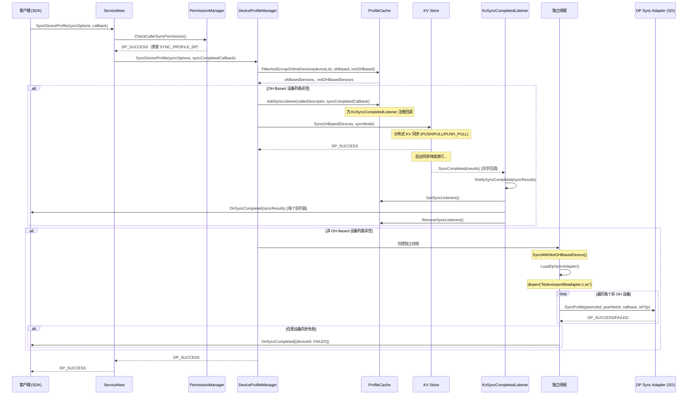
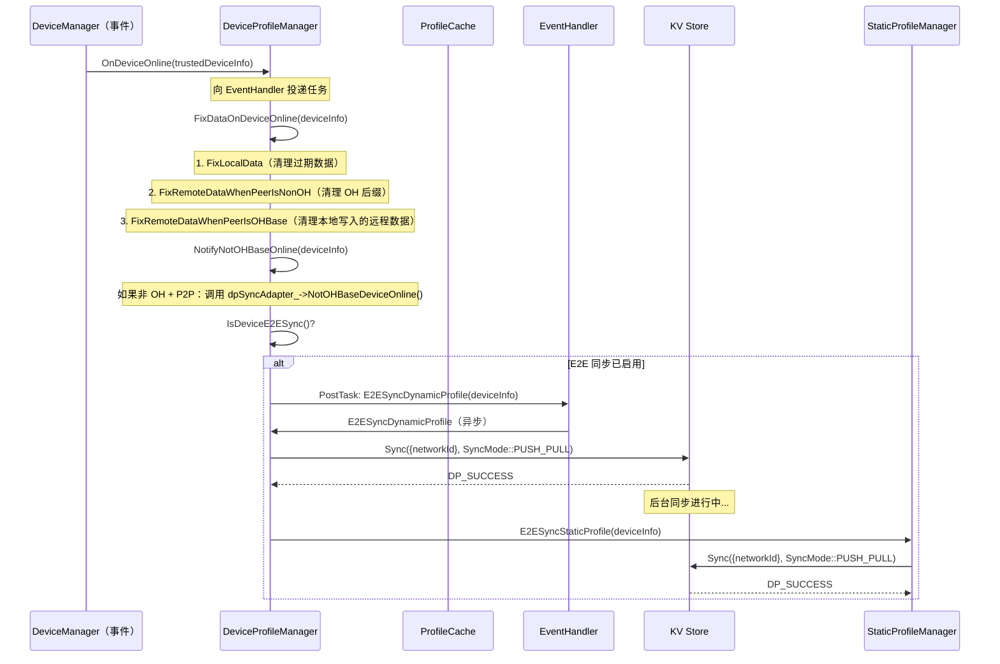

# 04 -- Profile 同步

> 本节涵盖 SyncDeviceProfile（动态同步）、SyncStaticProfile（静态同步）、设备上线时的端到端（E2E）同步，以及面向非 OH 设备的 DP Sync Adapter 插件系统。
>
> 主要源代码：`services/core/src/deviceprofilemanager/device_profile_manager.cpp`（SyncDeviceProfile）、`services/core/src/deviceprofilemanager/listener/kv_sync_completed_listener.cpp`

---

## 1. 概述

本节说明 DeviceProfile 模块如何通过两条不同的路径在分布式设备之间同步 Profile 数据：

1. **基于 OH 的设备**：使用分布式 KV Store 内置的同步机制（PUSH/PULL/PUSH_PULL），并通过同步完成监听器进行回调通知。
2. **非基于 OH 的设备**：使用通过 `dlopen` 动态加载的插件（`libdeviceprofileadapter.z.so`），该插件实现了 `IDPSyncAdapter` 接口。

**E2E（端到端）同步**在设备上线时自动触发，同时同步动态和静态 Profile。

---

## 2. SyncDeviceProfile 完整时序图

下图展示了 SyncDeviceProfile 的完整执行流程：设备按 OH 类型分为两组，OH 设备走 KV Store 原生同步路径并注册异步完成监听器，非 OH 设备走独立线程的 DP Sync Adapter 插件路径。



关键步骤说明：
1. `FilterAndGroupOnlineDevices` 根据 OS 类型将目标设备分为 OH 和非 OH 两组。
2. OH 设备同步路径：注册 `SyncListener` 后调用 KV Store 的 `Sync` 方法，同步完成后 `KvSyncCompletedListener` 异步通知所有已注册的监听器。
3. 非 OH 设备同步路径：在独立线程中加载 DP Sync Adapter 插件，对每个设备调用 `SyncProfile`。失败时通过回调通知调用方。

---

## 3. 设备上线时的 E2E 同步

下图展示了当设备上线时的处理流程，包括数据一致性修复（FixDataOnDeviceOnline）和端到端同步触发。



### E2E 同步条件

`IsDeviceE2ESync()` 仅在**同时满足以下所有条件**时返回 true：
1. `ContentSensorManagerUtils::IsDeviceE2ESync()` 返回 true（设备级开关）
2. 如果启用了企业空间（`IsEnterpriseSpaceEnable()`），当前用户必须在企业空间中（`CurrentIsEnterpriseSpace()`）

---

## 4. 同步模式对比

| 模式 | 方向 | 使用场景 | 行为 |
|---|---|---|---|
| `PULL` (0) | 远程 --> 本地 | 本地需要从特定设备获取最新数据 | 仅从目标设备拉取数据；不发送本地数据 |
| `PUSH` (1) | 本地 --> 远程 | 本地有新数据需要共享 | 仅将本地数据推送到目标设备；不接收远程数据 |
| `PUSH_PULL` (2) | 双向 | 设备上线时的 E2E 同步、全量同步 | 双向交换数据；合并差异 |

**E2E 同步始终使用 `PUSH_PULL` 模式**，确保连接后双方设备都拥有最新数据。

---

## 5. DP Sync Adapter 插件加载

本节说明面向不支持分布式 KV Store 的非 OpenHarmony 设备，DP 如何使用动态加载的同步适配器。

### 加载流程

```text
LoadDpSyncAdapter():
  1. dlopen("libdeviceprofileadapter.z.so", RTLD_NOW | RTLD_NOLOAD)  // 检查是否已加载
  2. 如果尚未加载：dlopen("libdeviceprofileadapter.z.so", RTLD_NOW)
  3. dlsym(handle, "CreateDPSyncAdapterObject")  // 获取工厂函数
  4. CreateDPSyncAdapterObject() --> IDPSyncAdapter* adapter
  5. adapter->Initialize()  // 必须返回 DP_SUCCESS
  6. 将 adapter 存储为 shared_ptr<IDPSyncAdapter> dpSyncAdapter_
  7. 设置 isAdapterSoLoaded_ = true
```

### 卸载流程

```text
UnloadDpSyncAdapter():
  1. dpSyncAdapter_->Release()  // 适配器清理
  2. dpSyncAdapter_ = nullptr
  3. dlopen("libdeviceprofileadapter.z.so", RTLD_NOW | RTLD_NOLOAD)
  4. 如果 handle 非空：dlclose(handle)
  5. 设置 isAdapterSoLoaded_ = false
```

### IDPSyncAdapter 接口（定义于 `common/include/interfaces/i_dp_sync_adapter.h`）

| 方法 | 说明 |
|---|---|
| `Initialize()` | 一次性适配器初始化 |
| `Release()` | 适配器清理 |
| `SyncProfile(peerUdid, peerNetId, callback, isP2p)` | 与非 OH 设备同步 Profile |
| `NotOHBaseDeviceOnline(peerUdid, peerNetId, isP2p)` | 通知适配器有非 OH 设备上线 |
| `FixDiffProfiles(params)` | 修复 Profile 差异 |

### Sync Adapter 线程模型

非 OH 同步在一个**独立线程**（`std::thread(syncTask).detach()`）上运行，避免阻塞 IPC 线程。每个非 OH 设备在同一个线程内按顺序处理。失败时通过 `SyncWithNotOHBasedDeviceFailed` 回调通知原始调用方（`ISyncCompletedCallback::OnSyncCompleted`）。

---

## 6. Sync Listener 生命周期

### 注册

```text
SyncDeviceProfile() -->
  ProfileCache::AddSyncListener(callerDescriptor, syncCompletedCallback)
    --> syncListeners_[callerDescriptor] = callback
```

### 完成通知

```text
KvSyncCompletedListener::SyncCompleted(results) -->
  1. 向 EventHandler 投递任务
  2. NotifySyncCompleted(syncResults):
     - ProfileCache::GetSyncListeners(syncListeners)
     - 遍历每个监听器：syncListenerProxy->OnSyncCompleted(syncResults)
     - ProfileCache::RemoveSyncListeners(syncListeners)
```

### 死亡清理

`SyncSubscriberDeathRecipient` 和 `KvStoreDeathRecipient` 在以下情况处理清理：
- 订阅者的远程对象死亡（IPC 断开）
- KV Store 服务死亡（进程崩溃/重启）

两种情况下，监听器都会被从缓存中移除，防止出现悬挂引用。

---

## 7. 静态同步与动态同步的差异

| 方面 | 动态同步（SyncDeviceProfile） | 静态同步（SyncStaticProfile） |
|---|---|---|
| **管理器** | DeviceProfileManager | StaticProfileManager |
| **Store ID** | `"dp_kv_store"` | `"dp_kv_static_store"` |
| **KV Store 类型** | `TYPE_DYNAMICAL` | （独立的静态 KV Store） |
| **同步完成监听器** | `KvSyncCompletedListener("dp_kv_store")` | `KvSyncCompletedListener("dp_kv_static_store")` |
| **监听器存储** | `ProfileCache::syncListeners_` | `StaticProfileManager::syncListeners_` |
| **权限要求** | `CheckCallerSyncPermission()` (SYNC_PROFILE_DP) | `CheckCallerSyncPermission()` (SYNC_PROFILE_DP) |
| **E2E 触发** | `E2ESyncDynamicProfile()` | `E2ESyncStaticProfile()` |
| **非 OH 支持** | 是（DP Sync Adapter） | 否（仅限 OH 设备） |

---

## 8. 设备筛选：OH 与非 OH

`ProfileCache::FilterAndGroupOnlineDevices` 将目标设备列表分为两组：

1. **基于 OH 的设备**：OS 类型为 `OHOS_TYPE`，设备在线。这些设备使用原生 KV Store 同步路径。
2. **非基于 OH 的设备**：OS 类型不是 `OHOS_TYPE`，设备在线。这些设备使用 DP Sync Adapter 插件路径。每个条目为 `(udid, networkId, isP2p)` 元组。

如果两组都为空（所有设备离线），返回 `DP_INVALID_PARAMS`。

---

## 9. 设备上线时的数据修复

当设备上线时，`FixDataOnDeviceOnline` 执行数据一致性修复：

### 修复阶段

| 阶段 | 方法 | 说明 |
|---|---|---|
| 1 | `GetProfilesByOwner(localUuid)` | 获取由本地设备写入的所有 Profile（按 UUID 所有者） |
| 2 | `FixLocalData(localUdid, localDataByOwner)` | 删除非本地写入的本地键数据（过期的云端数据） |
| 3 | `FixRemoteDataWhenPeerIsNonOH(remoteUdid)` | 当对端为非 OH 时：清理 OH 后缀的键和特定服务名（"collaborationFwk"、"Nfc_Publish_Br_Mac_Address"） |
| 4 | `FixRemoteDataWhenPeerIsOHBase(remoteUdid, localDataByOwner)` | 当对端为 OH 时：从本地存储中删除本地写入的远程设备数据 |

---

## 10. 错误码参考

| 错误码 | 值 | 触发条件 |
|---|---|---|
| `DP_SUCCESS` | 0 | 操作成功 |
| `DP_PERMISSION_DENIED` | 98566155 | 调用方缺少同步权限 |
| `DP_INVALID_PARAMS` | 98566144 | 参数无效（设备列表为空、回调为空） |
| `DP_SYNC_DEVICE_FAIL` | 98566203 | KV Sync 调用失败 |
| `DP_KV_SYNC_FAIL` | 98566204 | KV 同步操作失败 |
| `DP_LOAD_SYNC_ADAPTER_FAILED` | 98566248 | DP Sync Adapter 的 dlopen/dlsym 失败 |
| `DP_SYNC_INIT_FAILED` | 98566240 | Sync Adapter Initialize 失败 |
| `DP_SYNC_PROFILE_FAILED` | 98566241 | Sync Adapter SyncProfile 失败 |
| `DP_RUN_LOADED_FUNCTION_FAILED` | 98566247 | RunloadedFunction 调用失败 |
| `DP_UNLOAD_SA_FAIL` | 98566237 | 卸载 System Ability 失败 |
| `DP_KV_DB_PTR_NULL` | 98566189 | KV Store 指针为空 |
| `DP_GET_KV_DB_FAIL` | 98566199 | KV Get 操作失败 |
| `DP_GET_DEVICE_ENTRIES_FAIL` | 98566275 | GetDeviceEntries 失败 |

---

## 11. 关键代码路径

| 操作 | 入口函数 | 源文件 | 行号 |
|---|---|---|---|
| SyncDeviceProfile（服务层） | `distributed_device_profile_service_new.cpp` | 831 |
| SyncStaticProfile（服务层） | `distributed_device_profile_service_new.cpp` | 844 |
| DPM::SyncDeviceProfile | `device_profile_manager.cpp` | 489 |
| FilterAndGroupOnlineDevices | （ProfileCache） | -- |
| AddSyncListener | （ProfileCache） | -- |
| KV Store Sync 调用 | `device_profile_manager.cpp` | 517 |
| DPM::LoadDpSyncAdapter | `device_profile_manager.cpp` | 534 |
| DPM::UnloadDpSyncAdapter | `device_profile_manager.cpp` | 582 |
| DPM::SyncWithNotOHBasedDevice | `device_profile_manager.cpp` | 603 |
| DPM::RunloadedFunction | `device_profile_manager.cpp` | 641 |
| SyncWithNotOHBasedDeviceFailed | `device_profile_manager.cpp` | 625 |
| DPM::OnDeviceOnline | `device_profile_manager.cpp` | 758 |
| DPM::FixDataOnDeviceOnline | `device_profile_manager.cpp` | 769 |
| DPM::E2ESyncDynamicProfile | `device_profile_manager.cpp` | 916 |
| DPM::NotifyNotOHBaseOnline | `device_profile_manager.cpp` | 873 |
| DPM::IsDeviceE2ESync | `device_profile_manager.cpp` | 1203 |
| KvSyncCompletedListener::SyncCompleted | `kv_sync_completed_listener.cpp` | 63 |
| KvSyncCompletedListener::NotifySyncCompleted | `kv_sync_completed_listener.cpp` | 94 |
| KvSyncCompletedListener::NotifyStaticSyncCompleted | `kv_sync_completed_listener.cpp` | 112 |
| FixLocalData | `device_profile_manager.cpp` | 950 |
| FixRemoteDataWhenPeerIsNonOH | `device_profile_manager.cpp` | 980 |
| FixRemoteDataWhenPeerIsOHBase | `device_profile_manager.cpp` | 1016 |
| DPM::FixDiffProfiles | `device_profile_manager.cpp` | 1037 |
