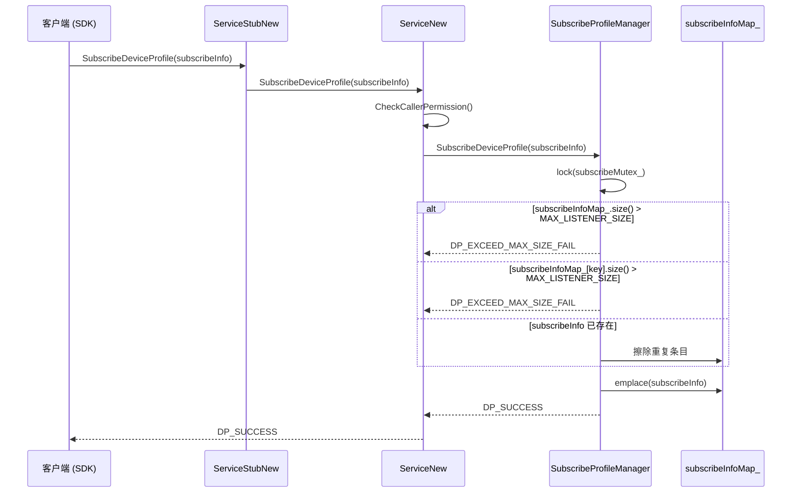
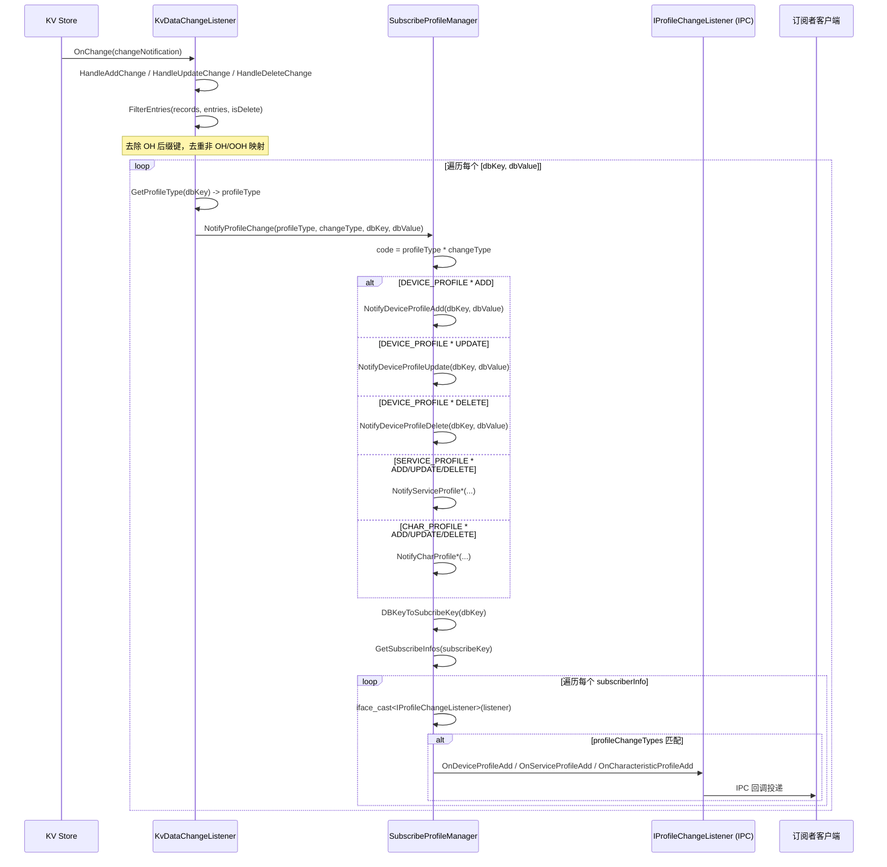
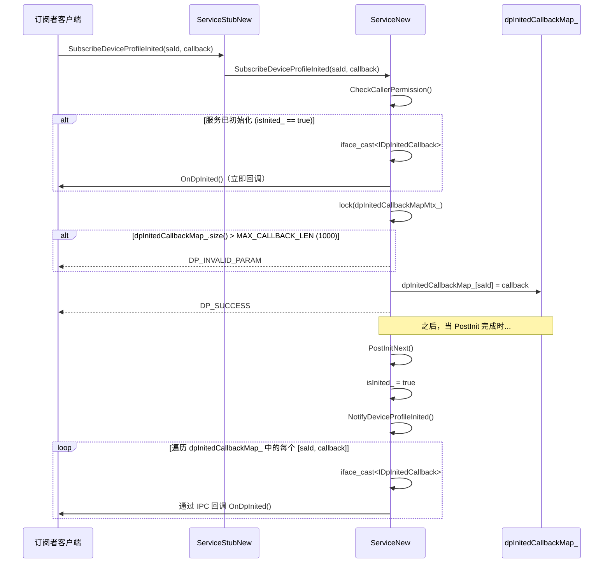

# 05 -- 订阅与通知

> 本节涵盖 Profile 变更订阅管理和事件通知分发机制。
>
> 主要源代码：`services/core/src/subscribeprofilemanager/subscribe_profile_manager.cpp`、`services/core/src/deviceprofilemanager/listener/kv_data_change_listener.cpp`

---

## 1. SubscribeDeviceProfile 时序图

下图展示了客户端订阅 Profile 变更通知的完整流程，包括订阅信息去重和容量限制检查。



关键步骤说明：
1. 订阅前需要锁保护（`subscribeMutex_`），先检查全局 map 大小和单键订阅者数量是否超过 `MAX_LISTENER_SIZE` 限制。
2. 如果相同的订阅信息已存在，先擦除旧条目再重新插入，实现订阅更新。
3. 订阅成功后，KV Store 数据变更会通过 `KvDataChangeListener` 驱动通知链。

---

### 数据变更驱动的通知链

下图展示了从 KV Store 数据变更到最终 IPC 通知分发的完整链路，包括键类型识别、Profile 类型映射、OH 后缀标准化以及订阅者匹配检查。



关键步骤说明：
1. `KvDataChangeListener::OnChange` 接收 KV Store 变更通知后，通过 `FilterEntries` 去重和清理 OH 后缀。
2. `GetProfileType` 从 dbKey 解析出 Profile 类型（DEVICE_PROFILE、SERVICE_PROFILE、CHAR_PROFILE）。
3. 通过 `code = profileType * changeType` 计算动作码，分发到对应的 `Notify*` 方法。
4. `DBKeyToSubcribeKey` 进行 OH 后缀标准化后查找匹配的订阅者。
5. 每个订阅者通过 `profileChangeTypes` 筛选确认是否需要接收此类通知，然后通过 IPC 回调投递。

---

## 2. SubscribeDeviceProfileInited 时序图

下图展示了服务初始化完成的订阅机制：若服务已初始化则立即回调，否则待初始化完成后统一通知。



取消订阅时，`UnSubscribeDeviceProfileInited(saId)` 在互斥锁保护下从 `dpInitedCallbackMap_` 中擦除对应条目。

---

## 3. 通知分发矩阵

本节说明通知分发的完整映射关系。分发机制使用 `profileType * changeType` 作为复合动作码。完整的 3x3 矩阵如下：

| ProfileType | ADD (1) | UPDATE (2) | DELETE (3) |
|---|---|---|---|
| **DEVICE_PROFILE (1)** | code=1: `NotifyDeviceProfileAdd` -> `OnDeviceProfileAdd` | code=2: `NotifyDeviceProfileUpdate` -> `OnDeviceProfileUpdate` | code=3: `NotifyDeviceProfileDelete` -> `OnDeviceProfileDelete` |
| **SERVICE_PROFILE (2)** | code=2: `NotifyServiceProfileAdd` -> `OnServiceProfileAdd` | code=4: `NotifyServiceProfileUpdate` -> `OnServiceProfileUpdate` | code=6: `NotifyServiceProfileDelete` -> `OnServiceProfileDelete` |
| **CHAR_PROFILE (3)** | code=3: `NotifyCharProfileAdd` -> `OnCharacteristicProfileAdd` | code=6: `NotifyCharProfileUpdate` -> `OnCharacteristicProfileUpdate` | code=9: `NotifyCharProfileDelete` -> `OnCharacteristicProfileDelete` |

**注意：** `code = profileType * changeType` 的映射存在歧义（例如 SERVICE_PROFILE*ADD=2 和 DEVICE_PROFILE*UPDATE=2 产生相同的 code 值）。实际分发**并不**以复合 code 作为主要分发器——`NotifyProfileChange` 方法使用 `switch(code)` 基于已知的唯一乘积 1-9 进行分发，将每个 code 映射到其特定的 notify 方法。之所以可行，是因为在上表完整的映射中，code 集合 {1,2,3, 2,4,6, 3,6,9} 包含唯一的值。

**NotifyProfileChange 中的分发流程：**
1. 计算 `code = static_cast<int32_t>(profileType) * static_cast<int32_t>(changeType)`
2. 通过 `DpRadarHelper::ReportNotifyProfileChange(code)` 向雷达上报
3. 根据 code 值 switch 选择具体的 `Notify*` 方法
4. 每个 `Notify*` 方法：从 dbKey/dbValue 反序列化 Profile，执行 `DBKeyToSubcribeKey`，查找 `subscribeInfoMap_`，遍历 `profileChangeTypes` 集合中包含匹配类型的订阅者，调用 IPC 回调

**Trust Device Profile 通知**（额外类型，不在 3x3 矩阵中）：
- `NotifyTrustDeviceProfileAdd` -> `OnTrustDeviceProfileAdd`
- `NotifyTrustDeviceProfileUpdate` -> `OnTrustDeviceProfileUpdate`
- `NotifyTrustDeviceProfileDelete` -> `OnTrustDeviceProfileDelete`
- `NotifyTrustDeviceProfileActive` -> `OnTrustDeviceProfileActive`
- `NotifyTrustDeviceProfileInactive` -> `OnTrustDeviceProfileInactive`

这些通知使用常量订阅键 `"trust_device_profile"`，并通过 `ProfileChangeType` 枚举值（如 `TRUST_DEVICE_PROFILE_ADD`、`TRUST_DEVICE_PROFILE_ACTIVE` 等）筛选订阅者。

---

## 4. 订阅键格式与匹配规则

### DB 键结构

KV Store 中的 Profile 数据通过 `SEPARATOR`（`#` 字符）分隔的结构化格式进行键控：

```
<prefix>#<deviceId>#<serviceName|userId>#[<charKey>]#[<userId_suffix>]
```

示例：
- Device Profile：`dev#<udid>#<userId>`
- Service Profile：`svr#<udid>#<serviceName>[_ohSuffix]#<userId>`
- Characteristic Profile：`char#<udid>#<serviceName>[_ohSuffix]#<charKey>#[<userId>]`

### DB 键到订阅键的映射（`DBKeyToSubcribeKey`）

函数 `DBKeyToSubcribeKey` 将原始 KV Store 键转换为订阅查找键：

1. 按 `SEPARATOR` 将 dbKey 拆分为多个部分
2. 如果键包含超过 2 个部分，第三部分（索引 2，即 serviceName 元素）的 OH 后缀通过 `CheckAndRemoveOhSuffix` 去除
3. 用 `SEPARATOR` 重新拼接各部分组成 subscribeKey

**OH 后缀处理：** 以 `_ohSuffix`（如 `_OHOS`）结尾的服务名在订阅匹配时会被移除后缀。这确保使用不带 OH 后缀的服务名注册的订阅者也能收到 OH 后缀键的通知。反向不成立——使用 OH 后缀键注册的订阅者只能匹配到完全相同的 DB 键。

### 键匹配规则

1. **精确匹配：** 经过 `DBKeyToSubcribeKey` 转换后的键必须与 `subscribeInfoMap_` 中的键精确匹配
2. **OH 后缀标准化：** 数据变更时，DB 键在查找前会去除 OH 后缀；订阅者以不带 OH 后缀的键形式注册
3. **空结果处理：** 如果转换后的键没有匹配的订阅者，`GetSubscribeInfos` 返回空集合，不发送任何通知

---

## 5. 订阅者容量限制

| 限制 | 值 | 作用域 |
|---|---|---|
| `MAX_LISTENER_SIZE` | 100 | 每个订阅键的最大订阅者数量，以及顶层 `subscribeInfoMap_` 的最大条目数 |
| `MAX_CALLBACK_LEN` | 1000 | `dpInitedCallbackMap_` 的最大条目数（用于 `SubscribeDeviceProfileInited`） |
| `MAX_CALLBACK_LEN` | 1000 | `pinCodeCallbackMap_` 的最大条目数（用于 `SubscribePinCodeInvalid`） |
| `MAX_CALLBACK_LEN` | 1000 | `businessCallbackMap_` 的最大条目数（用于 `RegisterBusinessCallback`） |

当 `subscribeInfoMap_.size() > MAX_LISTENER_SIZE`（100）时，订阅被拒绝并返回 `DP_EXCEED_MAX_SIZE_FAIL`。同样的检查也适用于单键级别：`subscribeInfoMap_[key].size() > MAX_LISTENER_SIZE` 会阻止单个键的订阅者超过 100 个。

**重要：** `MAX_LISTENER_SIZE` 常量为 100（而非某些上下文中提到的 1000）。1000 的限制（`MAX_CALLBACK_LEN`）适用于 `ServiceNew` 中的回调 map，如 init/pin/business 回调。

---

## 6. SubscribeInfo 结构与 profileChangeTypes 过滤器

`SubscribeInfo` 类封装了以下信息：
- **saId** (int32_t)：订阅者的 System Ability ID
- **subscribeKey** (std::string)：订阅键（DB 键的转换版本）
- **profileChangeTypes** (std::set\<ProfileChangeType\>)：订阅者感兴趣的变更类型位掩码集合
- **listener** (sptr\<IRemoteObject\>)：用于回调投递的 IPC 远程对象

**profileChangeTypes 过滤：** 分发通知时，集合中的每个订阅者都会检查其 `profileChangeTypes` 集合。只有当集合中包含相关的变更类型（如 `DEVICE_PROFILE_ADD`、`SERVICE_PROFILE_DELETE`、`CHAR_PROFILE_UPDATE`）时，才会调用 IPC 回调。这允许单个订阅者为给定的键接收部分变更类型。

`SubscribeInfo` 使用自定义的哈希（`SubscribeHash`）和比较（`SubscribeCompare`）仿函数进行 `std::unordered_set` 存储。重复检测基于 `SubscribeCompare`，允许同一 SA 通过擦除和重新插入来更新其订阅。

---

## 7. 死亡接收者清理

当订阅者进程死亡时，其 IPC 代理变为无效。清理机制通过以下方式工作：

1. **IProfileChangeListener 代理校验：** 每次通知迭代调用 `iface_cast<IProfileChangeListener>(subscriberInfo.GetListener())`。如果转换返回 nullptr（死亡或无效对象），该订阅者被**静默跳过**——不会从 map 中移除。

2. **无显式的过期条目 GC：** `subscribeInfoMap_` 不会定期清理死亡订阅者。死亡条目会持续累积，直到订阅者显式调用 `UnSubscribeDeviceProfile` 或服务重启。

3. **UnSubscribeDeviceProfile 清理：** 当客户端正常取消订阅时，条目被擦除。如果该键的订阅者集合变为空，整个键条目从 map 中移除。

**注意：** `dpInitedCallbackMap_`、`pinCodeCallbackMap_` 和 `businessCallbackMap_` 同样缺少自动的死亡接收者清理——每次回调调用通过 `iface_cast` 校验代理并跳过空指针。

---

## 8. 业务事件通知路径

本节说明业务事件采用独立于 KV 数据变更的通知路径：

```
Client -> PutBusinessEventKey(ServiceNew)
  -> 权限检查
  -> BusinessEventManager::PutBusinessEvent（KV Store 写入）
  -> NotifyBusinessEvent(event)
    -> lock(businessEventCallbackMapMtx_)
    -> 遍历 businessCallbackMap_（key = {saId, businessKey}）
    -> 按匹配的 businessKey 过滤
    -> 向 EventHandler 投递任务：BusinessEventExt(event.key, event.value)
    -> callbackProxy->OnBusinessEvent(eventExt) 通过 IPC 回调
```

`businessCallbackMap_` 使用组合键 `std::pair<std::string saId, std::string businessKey>`。注册（`RegisterBusinessCallback`）检查 `MAX_CALLBACK_LEN` 限制，并拒绝重复的 `{saId, businessKey}` 对。

---

## 9. 关键代码路径

| 操作 | 入口函数 | 源文件 |
|---|---|---|
| 订阅 | `SubscribeProfileManager::SubscribeDeviceProfile` | `services/core/src/subscribeprofilemanager/subscribe_profile_manager.cpp` |
| 取消订阅 | `SubscribeProfileManager::UnSubscribeDeviceProfile` | `services/core/src/subscribeprofilemanager/subscribe_profile_manager.cpp` |
| 批量订阅 | `SubscribeProfileManager::SubscribeDeviceProfile(map)` | `services/core/src/subscribeprofilemanager/subscribe_profile_manager.cpp` |
| 数据变更 -> 通知 | `KvDataChangeListener::OnChange` -> `HandleAddChange/HandleUpdateChange/HandleDeleteChange` -> `NotifyProfileChange` | `services/core/src/deviceprofilemanager/listener/kv_data_change_listener.cpp` |
| 分发通知 | `SubscribeProfileManager::NotifyProfileChange` -> `NotifyDeviceProfileAdd/Update/Delete` 等 | `services/core/src/subscribeprofilemanager/subscribe_profile_manager.cpp` |
| 初始化回调订阅 | `ServiceNew::SubscribeDeviceProfileInited` | `services/core/src/distributed_device_profile_service_new.cpp` |
| 初始化回调触发 | `ServiceNew::NotifyDeviceProfileInited` | `services/core/src/distributed_device_profile_service_new.cpp` |
| PinCode 订阅 | `ServiceNew::SubscribePinCodeInvalid` | `services/core/src/distributed_device_profile_service_new.cpp` |
| PinCode 通知 | `ServiceNew::NotifyPinCodeInvalid` | `services/core/src/distributed_device_profile_service_new.cpp` |
| 业务回调注册 | `ServiceNew::RegisterBusinessCallback` | `services/core/src/distributed_device_profile_service_new.cpp` |
| 业务事件通知 | `ServiceNew::NotifyBusinessEvent` | `services/core/src/distributed_device_profile_service_new.cpp` |
| DB 键 -> 订阅键 | `SubscribeProfileManager::DBKeyToSubcribeKey` | `services/core/src/subscribeprofilemanager/subscribe_profile_manager.cpp` |
| OH 后缀标准化 | `ProfileUtils::CheckAndRemoveOhSuffix` | `common/src/utils/profile_utils.cpp` |
