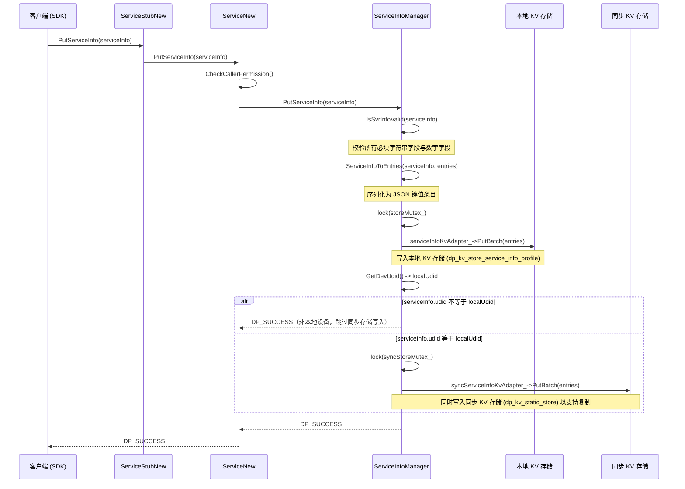
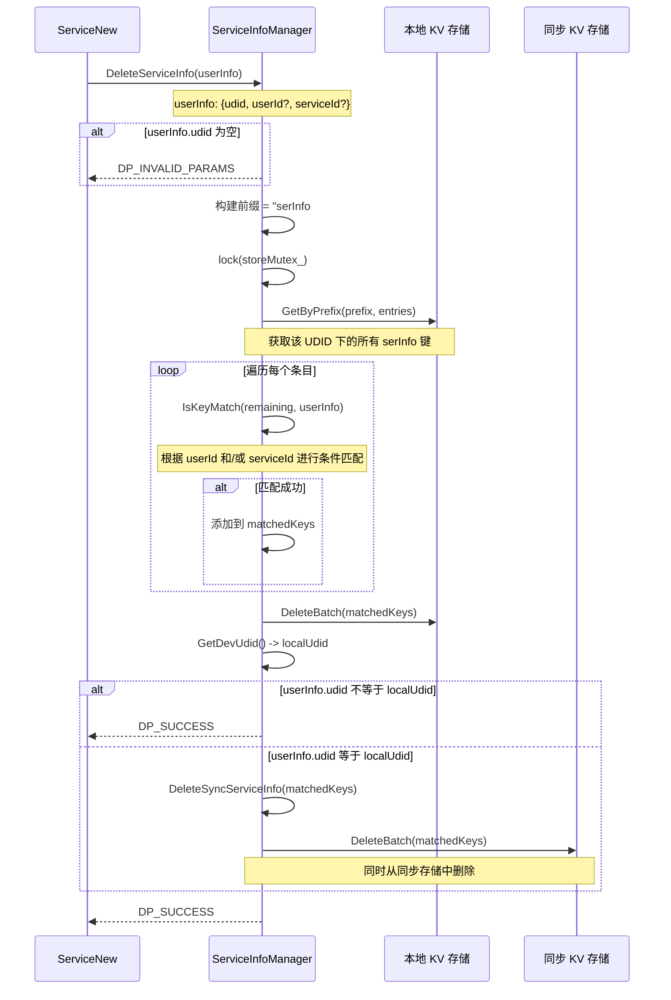
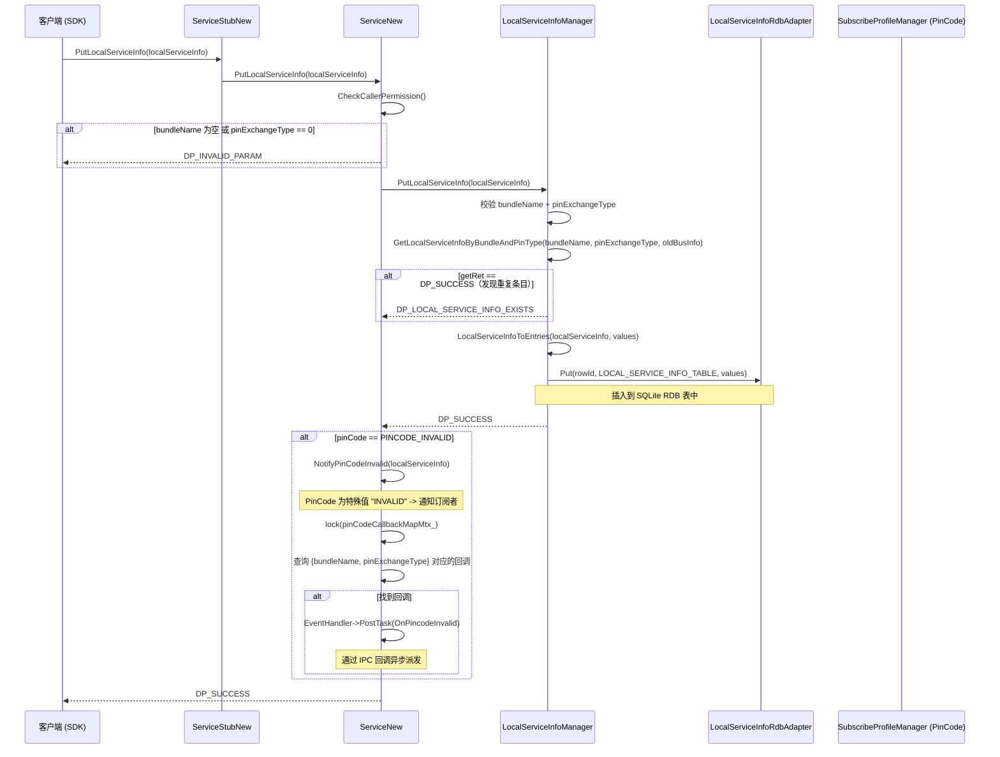

# 06 - 服务信息管理

ServiceInfo 与 LocalServiceInfo 的 CRUD 操作、双层 KV 存储架构，以及 PinCode 失效通知机制。

---

## 1. PutServiceInfo 时序

本节说明 ServiceInfo 的写入流程，包括字段校验、JSON 序列化、本地 KV 写入，以及在 UDID 匹配本地设备时同步写入同步 KV 存储的完整路径。

下图展示了 PutServiceInfo 的调用链路：



关键步骤说明：
1. 调用方通过 SDK 发起 `PutServiceInfo`，经由 IPC 代理到达 `ServiceNew`，首先进行调用方权限检查。
2. `ServiceInfoManager` 收到请求后，调用 `IsSvrInfoValid` 对 `ServiceInfo` 对象进行完整性校验（必填字符串字段与数字字段校验）。
3. 校验通过后，将 `ServiceInfo` 序列化为 JSON 键值列表，加锁后通过 `ServiceInfoKvAdapter` 写入本地 KV 存储。
4. 获取本地设备 UDID 并与传入的 UDID 比较：如果 UDID 不匹配，说明是远程设备数据，仅写入本地存储；如果匹配，加锁后同时写入同步 KV 存储，用于跨设备数据复制。

**字段校验（`IsSvrInfoValid`）：** `ServiceInfo` 对象在存储前需经过校验。必填字符串字段（udid, serviceOwnerPkgName, serviceType, serviceName, serviceDisplayName, customData, serviceCode, extraData, version, description, displayId, serviceId, timeStamp）必须为非空 JSON 字符串值。必填数字字段（userId, serviceOwnerTokenId, serviceRegisterTokenId, publishState, dataLen）必须通过 `cJSON_IsNumber` 校验。此外，displayId、serviceId 和 timeStamp 字符串还必须通过 `IsNumStr`（数字字符串校验）。

---

## 2. DeleteServiceInfo 时序

本节说明 ServiceInfo 的删除流程，包括按前缀查询、条件匹配过滤，以及在 UDID 匹配本地设备时同步删除同步存储中对应数据的逻辑。

下图展示了 DeleteServiceInfo 的调用链路：



关键步骤说明：
1. 传入 `userInfo`（包含 udid，可选 userId 和 serviceId）。若 udid 为空则直接返回参数无效错误。
2. 构建以 `serInfo#uid#` 为前缀的查询条件，加锁后从本地 KV 存储获取该设备下的所有服务信息条目。
3. 遍历查询结果，通过 `IsKeyMatch` 按 userId 和 serviceId 进行条件匹配：若两者均为默认值（0），则所有条目均匹配；否则以实际值进行过滤。
4. 对匹配到的键执行批量删除。若 UDID 等于本地设备 UDID，还需加锁后从同步 KV 存储中删除对应条目。

**IsKeyMatch 匹配逻辑：** 去掉前缀后的键值部分按 `SEPARATOR` 分割。若 `userInfo` 中的 `userId` 和 `serviceId` 均为默认值（0），则所有条目均匹配。否则，通过逐一比对 `userId` 和/或 `serviceId` 与键值中的对应部分来确定是否匹配。

---

## 3. PutLocalServiceInfo 时序

本节说明 LocalServiceInfo 的写入流程，包括字段校验、重复检测、RDB 插入，以及 PinCode 特殊值触发失效通知的完整链路。

下图展示了 PutLocalServiceInfo 的调用链路：



关键步骤说明：
1. 调用方传入 `LocalServiceInfo`，经权限检查后，若 `bundleName` 为空或 `pinExchangeType` 为 0（默认值）则返回参数无效错误。
2. `LocalServiceInfoManager` 首先进行字段校验，然后通过 `GetLocalServiceInfoByBundleAndPinType` 进行重复检测：若同一 `(bundleName, pinExchangeType)` 组合已存在，则返回 `DP_LOCAL_SERVICE_INFO_EXISTS`。
3. 将 `LocalServiceInfo` 转换为键值条目后，写入 RDB（SQLite）表 `LOCAL_SERVICE_INFO_TABLE`。
4. 若 `pinCode` 字段等于特殊值 `INVALID_PINCODE`，则在 RDB 写入成功后触发 `NotifyPinCodeInvalid`：加锁查找 `pinCodeCallbackMap_` 中匹配 `{bundleName, pinExchangeType}` 的回调，通过 `EventHandler::PostTask` 异步派发 `OnPincodeInvalid` 通知。

**UpdateLocalServiceInfo** 流程类似，但会先检查记录是否存在（若不存在则返回 `DP_NOT_FIND_DATA` 错误），然后通过唯一索引条件 `(bundleName, pinExchangeType)` 执行 RDB `Update`。

**DeleteLocalServiceInfo** 同样先检查存在性；若未找到则返回 `DP_SUCCESS`（幂等性保证）。若找到，则以相同的唯一索引条件执行 RDB `Delete`。

---

## 4. ServiceInfo 字段校验规则

本节说明 `IsSvrInfoValid` 以及 `ValidateStringFields` / `ValidateNumberFields` 方法所强制执行的校验规则。

### 必填字符串字段（必须为非空 `valuestring`）

| 字段 | JSON 键名 | 描述 |
|---|---|---|
| udid | `udid` | 设备唯一标识 |
| serviceOwnerPkgName | `serviceOwnerPkgName` | 所属服务的包名 |
| serviceType | `serviceType` | 服务类型分类 |
| serviceName | `serviceName` | 服务名称 |
| serviceDisplayName | `serviceDisplayName` | UI 显示名称 |
| customData | `customData` | 自定义服务数据 |
| serviceCode | `serviceCode` | 服务代码标识 |
| extraData | `extraData` | 附加数据载荷 |
| version | `version` | 服务版本字符串 |
| description | `description` | 服务描述 |
| displayId | `displayId` | 显示标识（同时必须为数字字符串） |
| serviceId | `serviceId` | 服务 ID（同时必须为数字字符串） |
| timeStamp | `timeStamp` | 时间戳字符串（同时必须为数字字符串） |

### 必填数字字段（必须通过 `cJSON_IsNumber` 校验）

| 字段 | JSON 键名 | 描述 |
|---|---|---|
| userId | `userId` | 用户 ID（整数） |
| serviceOwnerTokenId | `serviceOwnerTokenId` | 服务所有者令牌 ID |
| serviceRegisterTokenId | `serviceRegisterTokenId` | 注册令牌 ID |
| publishState | `publishState` | 发布状态整数 |
| dataLen | `dataLen` | 数据长度整数 |

### 数字字符串字段（必须通过 `IsNumStr` 校验）

| 字段 | 描述 |
|---|---|
| displayId | 必须可转换为整数 |
| serviceId | 必须可转换为整数 |
| timeStamp | 必须可转换为整数 |

---

## 5. 双层 KV 存储模型

本节说明 ServiceInfo 采用的双层 KV 存储架构：本地存储负责主数据管理，同步存储负责跨设备数据复制。

| 存储层 | 存储 ID | KvAdapter 类型 | 用途 |
|---|---|---|---|
| **本地存储** | `dp_kv_store_service_info_profile` | `ServiceInfoKvAdapter`（动态） | 所有服务信息数据的主存储 |
| **同步存储** | `dp_kv_static_store` | `KVAdapter`（静态） | 跨设备同步的复制存储 |

### 写入路径
1. 数据始终先写入本地存储
2. 若写入成功且数据的 UDID 等于本地设备 UDID，则将相同数据同时写入同步存储
3. 若 UDID 为非本地设备（远程设备数据），仅写入本地存储——远程设备自行负责其同步存储的写入

### 读取路径
- `GetAllServiceInfoList`：通过空前缀查询从本地存储读取全部条目
- `GetServiceInfosByUserInfo`：从本地存储读取全部条目，在内存中按 UDID、userId 和 serviceId 进行过滤
- `GetEntriesByKeys`：从**同步存储**中读取指定键（用于跨设备数据获取）

### 初始化
两个适配器在 `ServiceInfoManager::Init()` 期间完成初始化：
- 本地适配器：`ServiceInfoKvAdapter`，注册 `KvDeathRecipient(STORE_ID)`，类型为 `TYPE_DYNAMICAL`
- 同步适配器：`KVAdapter`，注册 `KvDataChangeListener(SYNC_STORE_ID)` 和 `KvDeathRecipient(SYNC_STORE_ID)`，类型为 `TYPE_DYNAMICAL`

若任一适配器初始化失败，则清理另一个。注册死亡接收者以便在 KV 存储崩溃时能够检测到。

---

## 6. ServiceInfo 与 ServiceProfile 对比

本节说明 ServiceInfo 与 ServiceProfile 在用途、键结构、存储方式和字段上的差异。

| 对比维度 | ServiceInfo | ServiceProfile |
|---|---|---|
| **用途** | 服务注册与发现元数据（谁提供什么服务） | 服务能力画像（服务具有什么能力） |
| **键结构** | `serInfo#<udid>#<userId>#<serviceId>#<displayId>` | `svr#<udid>#<serviceName>#<userId>` |
| **存储** | 双层 KV（本地 + 同步） | 单层动态 KV（dp_kv_store） |
| **管理器** | `ServiceInfoManager` | `DeviceProfileManager` |
| **字段** | udid, userId, serviceId, displayId, ownerPkgName, ownerTokenId, registerTokenId, timeStamp, publishState, serviceType, serviceName, displayName, customData, serviceCode, dataLen, extraData, version, description | deviceId, serviceName, serviceType, userId |
| **同步方式** | 设备上线时通过静态 KV 存储同步 | 设备上线时通过动态 KV 存储同步（PUSH_PULL） |

---

## 7. PinCode 失效通知机制

本节说明 PinCode 失效通知的订阅、触发和派发机制。

### 订阅
```
SubscribePinCodeInvalid(bundleName, pinExchangeType, callback)
```
- 需通过权限检查
- `bundleName` 必须非空
- `pinExchangeType` 不能为 `DEFAULT_PIN_EXCHANGE_TYPE`（0）
- 回调存储在 `pinCodeCallbackMap_` 中，键为 `std::pair(bundleName, pinExchangeType)`
- 最大回调数量：1000（`MAX_CALLBACK_LEN`）

### 触发
PinCode 失效通知在 `PutLocalServiceInfo` 被调用且 `LocalServiceInfo` 的 `pinCode` 字段等于特殊值 `INVALID_PINCODE` 时触发。通知在 `ServiceNew::PutLocalServiceInfo` 中 RDB 插入成功后触发。

### 派发
```
NotifyPinCodeInvalid(localServiceInfo):
  1. 加锁 pinCodeCallbackMapMtx_
  2. 按 {bundleName, pinExchangeType} 查找回调
  3. iface_cast 转换为 IPincodeInvalidCallback
  4. 向 EventHandler 提交 PostTask
  5. callbackProxy->OnPincodeInvalid(localServiceInfo) 通过异步 IPC 执行
```

### 取消订阅
```
UnSubscribePinCodeInvalid(bundleName, pinExchangeType):
  - 从 pinCodeCallbackMap_ 中擦除匹配的条目
```

---

## 8. 错误码

| 错误码 | 值 | 上下文 |
|---|---|---|
| `DP_SUCCESS` | 0 | 操作成功完成 |
| `DP_INVALID_PARAMS` | -1 | 缺少或无效参数（udid 为空、JSON 无效） |
| `DP_INVALID_PARAM` | -1 | 无效参数（bundleName 为空、pinExchangeType 为默认值） |
| `DP_INIT_DB_FAILED` | - | KV 适配器初始化失败 |
| `DP_KV_DB_PTR_NULL` | - | KV 适配器指针为空 |
| `DP_PUT_KV_DB_FAIL` | - | KV 存储批量写入失败 |
| `DP_GET_KV_DB_FAIL` | - | KV 存储读取失败 |
| `DP_DEL_KV_DB_FAIL` | - | KV 存储批量删除失败 |
| `DP_LOAD_JSON_FILE_FAIL` | - | 存储值的 JSON 解析失败 |
| `DP_NOT_FIND_DATA` | - | 未找到匹配的 ServiceInfo |
| `DP_LOCAL_SERVICE_INFO_EXISTS` | - | 检测到重复的 LocalServiceInfo |
| `DP_PUT_LOCAL_SERVICE_INFO_FAIL` | - | RDB 插入失败 |
| `DP_DELETE_LOCAL_SERVICE_INFO_FAIL` | - | RDB 删除失败 |
| `DP_UPDATE_LOCAL_SERVICE_INFO_FAIL` | - | RDB 更新失败 |
| `DP_GET_RESULTSET_FAIL` | - | RDB 查询结果集为空 |
| `DP_CREATE_TABLE_FAIL` | - | RDB 表创建失败 |
| `DP_CREATE_UNIQUE_INDEX_FAIL` | - | RDB 唯一索引创建失败 |
| `DP_NULLPTR` | - | IPC 回调代理转换返回空指针 |
| `DP_POST_TASK_FAILED` | - | EventHandler PostTask 失败 |
| `DP_PERMISSION_DENIED` | - | 调用方没有权限 |

---

## 关键代码路径

| 操作 | 入口函数 | 关键文件 |
|---|---|---|
| 写入 ServiceInfo | `ServiceInfoManager::PutServiceInfo` | `services/core/src/serviceinfo_manager/service_info_manager.cpp` |
| 删除 ServiceInfo | `ServiceInfoManager::DeleteServiceInfo` | `services/core/src/serviceinfo_manager/service_info_manager.cpp` |
| 获取全部 ServiceInfo | `ServiceInfoManager::GetAllServiceInfoList` | `services/core/src/serviceinfo_manager/service_info_manager.cpp` |
| 按用户信息查询 | `ServiceInfoManager::GetServiceInfosByUserInfo` | `services/core/src/serviceinfo_manager/service_info_manager.cpp` |
| 写入 LocalServiceInfo | `LocalServiceInfoManager::PutLocalServiceInfo` | `services/core/src/localserviceinfomanager/local_service_info_manager.cpp` |
| 更新 LocalServiceInfo | `LocalServiceInfoManager::UpdateLocalServiceInfo` | `services/core/src/localserviceinfomanager/local_service_info_manager.cpp` |
| 查询 LocalServiceInfo | `LocalServiceInfoManager::GetLocalServiceInfoByBundleAndPinType` | `services/core/src/localserviceinfomanager/local_service_info_manager.cpp` |
| 删除 LocalServiceInfo | `LocalServiceInfoManager::DeleteLocalServiceInfo` | `services/core/src/localserviceinfomanager/local_service_info_manager.cpp` |
| PinCode 订阅 | `ServiceNew::SubscribePinCodeInvalid` | `services/core/src/distributed_device_profile_service_new.cpp` |
| PinCode 通知 | `ServiceNew::NotifyPinCodeInvalid` | `services/core/src/distributed_device_profile_service_new.cpp` |
| 本地服务入口 | `ServiceNew::PutLocalServiceInfo` / `UpdateLocalServiceInfo` / `DeleteLocalServiceInfo` | `services/core/src/distributed_device_profile_service_new.cpp` |
