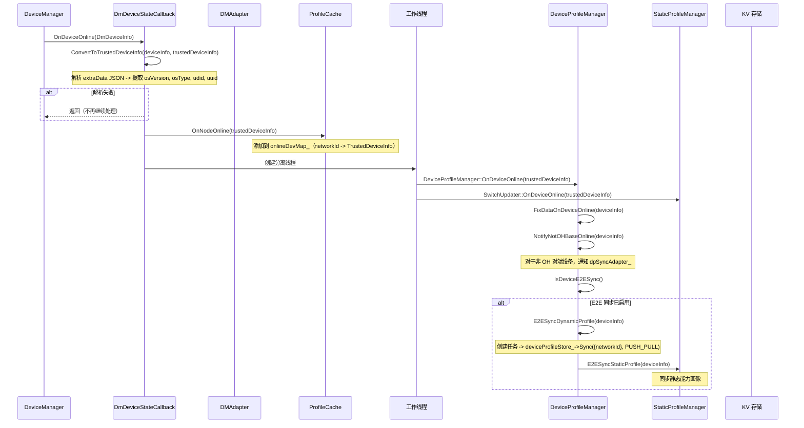
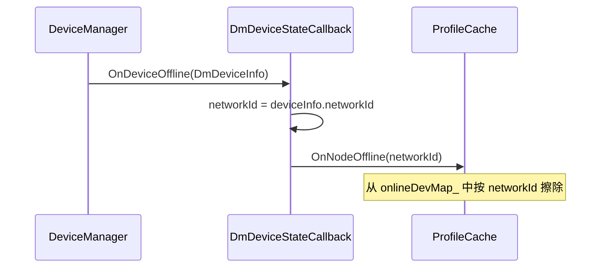
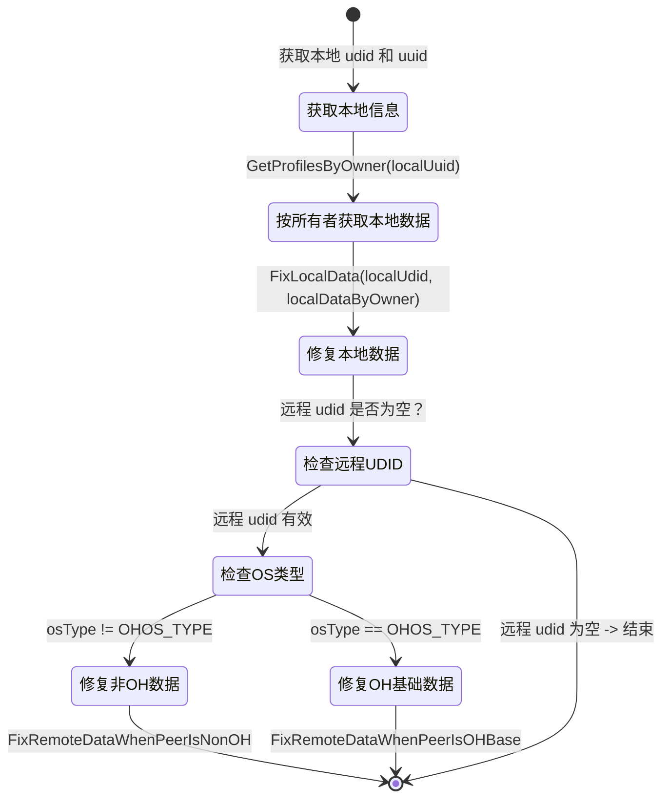

# 07 - 设备上线 / 下线级联处理

设备管理器集成、上线级联处理流程、数据修复逻辑、端到端同步以及下线清理机制。

---

## 1. 设备上线时序

本节说明设备上线时的完整处理链路：从 DeviceManager 回调触发开始，经过 TrustedDeviceInfo 转换、缓存更新，到异步线程中执行设备画像数据修复和端到端同步的全过程。

下图展示设备上线时的调用链路：



关键步骤说明：
1. `DeviceManager` 检测到设备上线后，通过 `DmDeviceStateCallback::OnDeviceOnline` 回调通知 DP 服务。
2. 回调首先将 `DmDeviceInfo` 转换为 `TrustedDeviceInfo`，解析 extraData JSON 提取 osVersion、osType、udid 和 uuid。若解析失败则终止处理。
3. 转换成功后，将设备信息加入 `ProfileCache` 的在线设备映射表 `onlineDevMap_`（以 networkId 为键）。
4. 启动一个分离工作线程，在异步上下文中执行后续的重量级操作。
5. 工作线程中依次执行：`FixDataOnDeviceOnline` 数据修复流水线、`NotifyNotOHBaseOnline` 非 OH 设备通知，以及 E2E 同步（若开关开启则执行动态画像和静态画像同步）。

---

## 2. 设备下线时序

本节说明设备下线时的处理流程。下线路径较为精简，仅从在线设备缓存中移除记录，不触发级联数据清理。

下图展示设备下线时的调用链路：



关键步骤说明：
1. `DeviceManager` 检测到设备下线后，通过 `DmDeviceStateCallback::OnDeviceOffline` 回调通知 DP 服务。
2. 从 `DmDeviceInfo` 中提取 `networkId`，调用 `ProfileCache::OnNodeOffline` 从在线设备映射表中移除该条目。
3. 下线路径不触发级联数据清理——已断开连接设备的残留数据继续保留在存储中。

---

## 3. 设备上线时的数据修复逻辑

本节说明 `FixDataOnDeviceOnline` 方法的数据修复流水线。该方法在设备上线时异步运行，将修复任务投递到 EventHandler 线程中执行。

下图展示数据修复流水线的状态流转：



关键步骤说明：
1. 首先获取本地设备的 udid 和 uuid。
2. 通过 `GetProfilesByOwner(localUuid)` 获取本地设备写入的所有画像数据。
3. 执行 `FixLocalData`：清理本地 KV 中存在但并非由本地设备写入的孤立条目。
4. 若远程 udid 有效，根据对端设备的 osType 分两路处理：非 OH 设备执行 `FixRemoteDataWhenPeerIsNonOH`，OH 设备执行 `FixRemoteDataWhenPeerIsOHBase`。若远程 udid 为空则直接结束。

### FixLocalData

**目的：** 清理云/网格存储中存在但并非由本地设备写入的本地画像数据。

```
FixLocalData(localUdid, localDataByOwner):
  1. GetProfilesByKeyPrefix(localUdid) -> localDataByKeyPrefix
     （获取本地 UDID 的所有 dev#、svr#、char# 键）
  2. 遍历 localDataByKeyPrefix 中的每个键：
     若键不在 localDataByOwner 中（即本地设备未写入该条目）：
       -> 加入 delKeys
  3. DeleteBatchByKeys(delKeys)
```

**清理理由：** 当设备上线且云端数据已同步下来后，可能存在一些以本地设备为键的条目并非由本地设备创建（由之前的同步或过期数据残留所致）。这些条目需要被清理。

### FixRemoteDataWhenPeerIsNonOH

**目的：** 清理非 OpenHarmony 对端设备的 OH 专属数据。

```
FixRemoteDataWhenPeerIsNonOH(remoteUdid):
  1. GetProfilesByKeyPrefix(remoteUdid) -> remoteDataByKeyPrefix
  2. 遍历每个键：
     - 若 serviceName 以 OH_PROFILE_SUFFIX 结尾 -> 加入 delKeys
     - 若条目为 SVR/CHAR 画像且 serviceName 在
       NON_OHBASE_NEED_CLEAR_SVR_NAMES 列表中
       ({"collaborationFwk", "Nfc_Publish_Br_Mac_Address"}) -> 加入 delKeys
  3. DeleteBatchByKeys(delKeys)
```

**清理理由：** 非 OH 设备无法消费 OH 专属的服务画像，因此带有 OH 后缀的条目以及已知的 OH 专属服务名称相关的条目均被清除。

### FixRemoteDataWhenPeerIsOHBase

**目的：** 清理本地设备曾为对端设备写入的数据。

```
FixRemoteDataWhenPeerIsOHBase(remoteUdid, localDataByOwner):
  1. 遍历 localDataByOwner 中的每个键（本地设备写入的条目）：
     若键包含 remoteUdid -> 加入 delKeys
  2. deviceProfileStore_->DeleteBatch(delKeys)
```

**清理理由：** 当对端 OH 设备上线时，本地设备此前为该对端设备写入的任何过期数据均被清除。对端设备将通过 KV 同步推送其自身的权威数据。

---

## 4. OH 设备与非 OH 设备的差异化处理

本节说明 OH 设备（osType 等于 OHOS_TYPE）与非 OH 设备在数据修复、E2E 同步、OH 后缀处理和适配器通知等方面的处理差异。

| 维度 | OH 设备（osType==OHOS_TYPE） | 非 OH 设备 |
|---|---|---|
| **数据修复** | FixLocalData + FixRemoteDataWhenPeerIsOHBase | FixLocalData + FixRemoteDataWhenPeerIsNonOH |
| **E2E 同步** | 完整动态同步（PUSH_PULL KV 同步）+ 静态画像同步 | 跳过动态同步；仅通知非 OH 适配器 |
| **OH 后缀处理** | OH 后缀键保留并同步 | OH 后缀键从本地存储中删除 |
| **非 OH 适配器** | 不调用 | `dpSyncAdapter_->NotOHBaseDeviceOnline` 以 UDID + networkId 调用（仅限 P2P 认证形态） |
| **服务名称过滤** | 无服务名称过滤 | 特定服务（`collaborationFwk`、`Nfc_Publish_Br_Mac_Address`）被清除 |

---

## 5. E2E 同步开关

本节说明 `IsDeviceE2ESync()` 方法的判定逻辑——该方法决定是否执行端到端同步。

```cpp
bool DeviceProfileManager::IsDeviceE2ESync() {
    if (!ContentSensorManagerUtils::GetInstance().IsDeviceE2ESync()) {
        return false;
    }
    if (ContentSensorManagerUtils::GetInstance().IsEnterpriseSpaceEnable() &&
        !MultiUserManager::GetInstance().CurrentIsEnterpriseSpace()) {
        return false;
    }
    return true;
}
```

需同时满足两个条件：
1. **设备级 E2E 同步支持：** `ContentSensorManagerUtils` 的 `IsDeviceE2ESync()` 返回 true（设备能力检查）
2. **企业空间门控：** 若启用了企业空间，则仅允许企业空间用户执行 E2E 同步。非企业空间用户被阻止。

当开关通过后，触发两项同步操作：
- **动态画像同步：** `deviceProfileStore_->Sync({networkId}, SyncMode::PUSH_PULL)` —— 通过分布式 KV 存储同步设备/服务/特性画像
- **静态画像同步：** `StaticProfileManager::E2ESyncStaticProfile(deviceInfo)` —— 同步静态能力画像

---

## 6. TrustedDeviceInfo 转换

本节说明 `ConvertToTrustedDeviceInfo` 方法如何将从 DeviceManager 获取的 `DmDeviceInfo` 转换为 DP 域使用的 `TrustedDeviceInfo`。

```
DmDeviceInfo（DeviceManager 原始数据）  TrustedDeviceInfo（DP 域）
  -> networkId                            -> networkId
  -> authForm                             -> authForm（int32_t）
  -> deviceTypeId                         -> deviceTypeId
  -> extraData（JSON 字符串）               -> extraData 解析后：
    ├── PARAM_KEY_OS_VERSION              -> osVersion（string）
    ├── PARAM_KEY_OS_TYPE                 -> osType（int32_t）
    ├── PARAM_KEY_UDID                    -> udid（string）
    └── PARAM_KEY_UUID                    -> uuid（string）
```

**校验规则：** 若 `extraData` 为空、JSON 解析失败，或四个必填字段（osVersion、osType、udid、uuid）中的任一字段缺失或类型不对，则转换失败，`OnDeviceOnline` 直接返回，不再继续后续处理。

---

## 关键代码路径

| 操作 | 入口函数 | 关键文件 |
|---|---|---|
| 设备上线回调 | `DmDeviceStateCallback::OnDeviceOnline` | `services/core/src/dm_adapter/dm_adapter.cpp` |
| 设备下线回调 | `DmDeviceStateCallback::OnDeviceOffline` | `services/core/src/dm_adapter/dm_adapter.cpp` |
| 设备上线级联处理 | `DeviceProfileManager::OnDeviceOnline` | `services/core/src/deviceprofilemanager/device_profile_manager.cpp` |
| 数据修复流水线 | `DeviceProfileManager::FixDataOnDeviceOnline` | `services/core/src/deviceprofilemanager/device_profile_manager.cpp` |
| 修复本地数据 | `DeviceProfileManager::FixLocalData` | `services/core/src/deviceprofilemanager/device_profile_manager.cpp` |
| 修复远程数据（非OH） | `DeviceProfileManager::FixRemoteDataWhenPeerIsNonOH` | `services/core/src/deviceprofilemanager/device_profile_manager.cpp` |
| 修复远程数据（OH基础） | `DeviceProfileManager::FixRemoteDataWhenPeerIsOHBase` | `services/core/src/deviceprofilemanager/device_profile_manager.cpp` |
| E2E 动态同步 | `DeviceProfileManager::E2ESyncDynamicProfile` | `services/core/src/deviceprofilemanager/device_profile_manager.cpp` |
| E2E 同步开关判定 | `DeviceProfileManager::IsDeviceE2ESync` | `services/core/src/deviceprofilemanager/device_profile_manager.cpp` |
| 非OH设备通知 | `DeviceProfileManager::NotifyNotOHBaseOnline` | `services/core/src/deviceprofilemanager/device_profile_manager.cpp` |
| TrustedDeviceInfo 转换 | `DmDeviceStateCallback::ConvertToTrustedDeviceInfo` | `services/core/src/dm_adapter/dm_adapter.cpp` |
| 在线/离线缓存跟踪 | `ProfileCache::OnNodeOnline` / `OnNodeOffline` | `services/core/src/utils/profile_cache.cpp` |
| 开关缓存同步（上线时） | `SwitchUpdater::OnDeviceOnline` | `services/core/src/deviceprofilemanager/listener/kv_data_change_listener.cpp` |
