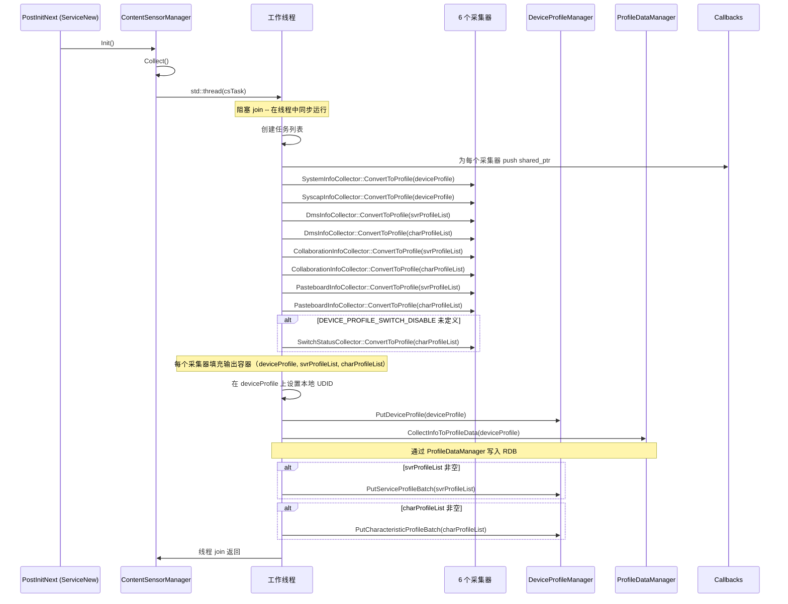
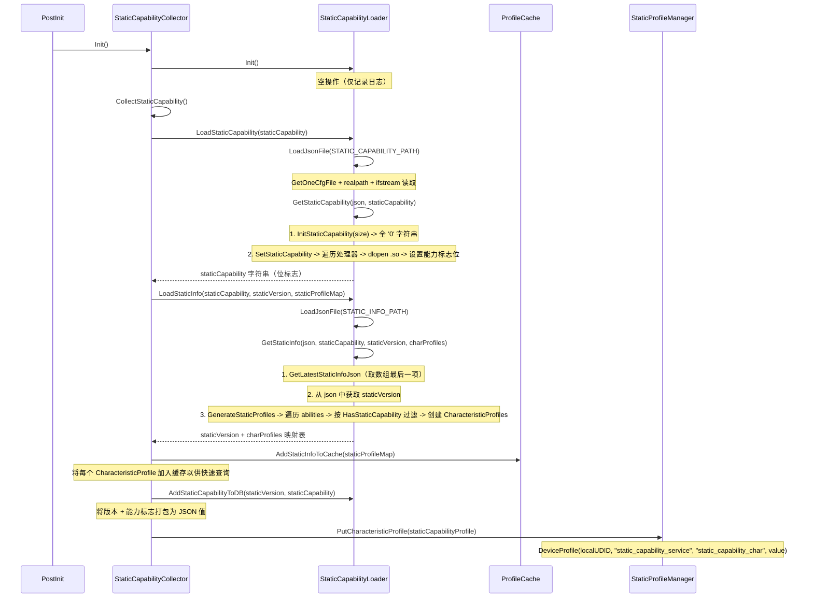
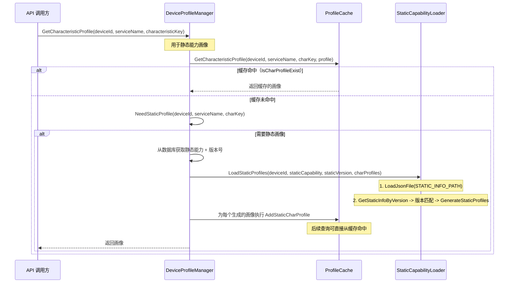

# 08 - 内容采集

本地设备数据采集流水线：ContentSensorManager 统一编排 6 个采集器，以及通过插件机制加载静态能力数据。

---

## 1. 内容采集启动时序

本节说明服务启动后内容采集的完整流程：ContentSensorManager 在工作线程中依次调度 6 个采集器收集设备信息，然后分别写入 KV 动态画像存储和 RDB 画像数据表。

下图展示了内容采集的启动和流水线执行过程：



关键步骤说明：
1. 服务初始化完成后，`PostInitNext` 调用 `ContentSensorManager::Init()` 和 `Collect()`，创建工作线程。
2. 工作线程中依次调用各采集器的 `ConvertToProfile` 方法，将采集到的数据填充到 `deviceProfile`（设备画像）、`svrProfileList`（服务画像列表）和 `charProfileList`（特性画像列表）中。
3. 在设备画像上设置本地 UDID 后，通过 `PutDeviceProfile` 写入 KV 动态存储，并通过 `CollectInfoToProfileData` 写入 RDB。
4. 若服务画像列表和特性画像列表非空，则分别批量写入对应的 KV 存储。

### CollectInfoToProfileData 详细流程

设备画像写入动态 KV 存储后，`CollectInfoToProfileData` 执行 RDB 的 upsert 操作：
1. 获取当前前台用户 ID（若无前台用户则默认为 U_100）
2. 从 `ProfileCache` 获取账户 ID
3. 从 RDB 中查询该设备+用户的已有画像
4. 若已存在画像，保留以下字段：wiseDeviceId、wiseUserId、setupType、registerTime、modifyTime、shareTime、accountId
5. 通过 `ProfileDataManager::PutDeviceProfile` 写入或更新

---

## 2. 静态能力采集时序

本节说明静态能力采集流程：StaticCapabilityCollector 协调 StaticCapabilityLoader 加载静态能力配置文件，通过 dlopen/dlsym 插件机制检测各项能力，生成能力位标志字符串，并将生成的静态画像写入分布式 KV 存储和本地缓存。

下图展示了静态能力采集的调用链路：



关键步骤说明：
1. `StaticCapabilityCollector` 首先调用 `LoadStaticCapability`，从 JSON 配置文件中读取能力处理器列表。
2. `SetStaticCapability` 遍历每个处理器条目：读取 `handler_name` 和 `handler_loc`，在 `CAPABILITY_FLAG_MAP` 中查找对应的位索引，通过 `dlopen` 加载 `.so` 文件，`dlsym` 调用 `GetStaticCapabilityCollector` 函数获取是否支持的布尔值，然后 `dlclose` 关闭句柄。若支持则将对应位设为 '1'。
3. 接着调用 `LoadStaticInfo` 加载静态信息配置文件，取数组最后一项作为最新版本，按静态能力标志位过滤生成 `CharacteristicProfile` 列表。
4. 将生成的静态画像加入 `ProfileCache` 缓存，并将能力标志和版本号写入数据库。

### 静态能力加载器插件机制

`SetStaticCapability` 函数处理每个能力处理器条目的流程：
1. 从 JSON 中读取 `handler_name` 和 `handler_loc`
2. 在 `CAPABILITY_FLAG_MAP` 中查找 `handler_name` 对应的位位置
3. 调用 `GetStaticCapabilityValue(handler_loc)`：
   - `dlopen` 加载 `handler_loc` 处的 `.so` 文件
   - `dlsym` 获取 `GetStaticCapabilityCollector` 函数
   - 调用该函数 -> 返回 `bool`（true = 支持）
   - `dlclose` 关闭句柄
4. 在静态能力字符串中设置对应位：'1' 表示支持，'0' 表示不支持

---

## 3. 静态能力查询时序

本节说明静态能力画像的查询流程：优先从 ProfileCache 缓存中查找，缓存未命中时则通过 StaticCapabilityLoader 从配置文件动态加载并回填缓存。

下图展示了静态能力查询的调用链路：



关键步骤说明：
1. 调用方通过 `GetCharacteristicProfile` 请求静态能力画像，首先尝试从 `ProfileCache` 中查找。
2. 若缓存命中，直接返回；若未命中，通过 `NeedStaticProfile` 判断是否需要加载静态画像。
3. 若需要，从数据库获取静态能力位标志和版本号，调用 `LoadStaticProfiles` 从 JSON 配置文件按版本匹配并生成画像列表。
4. 生成的画像回填到 `ProfileCache` 中，后续查询即可直接命中缓存。

**版本比较：** `StaticVersionCheck(peerVersion, localVersion)` 在对端版本与本地版本相等（完全匹配）时返回 true；若两者均通过 `STATIC_VERSION_RULES` 正则表达式校验，也返回 true。若任一方版本无效，则返回 false，该版本的静态信息将不被返回。

---

## 4. 采集器一览

本节汇总 6 个内容采集器的数据来源、输出类型和采集内容。

| 采集器 | 采集数据 | 输出类型 | 数据来源 |
|---|---|---|---|
| **SystemInfoCollector** | osType, osVersion, deviceName, productId, subProductId, sn, deviceModel, devType, manu, hiv, protType, productName | `DeviceProfile` | 系统参数 API（`GetParameter`）、ContentSensorManagerUtils |
| **SyscapInfoCollector** | 公开 OS 系统能力（编码后的二进制）+ 私有系统能力（编码后的字符串） | `DeviceProfile.osSysCap` | `syscap_interface.h`（`EncodeOsSyscap`、`EncodePrivateSyscap`） |
| **DmsInfoCollector** | DMS 服务 ID + DMS 版本/包信息 | `ServiceProfile` + `CharacteristicProfile` | DMS 常量（来自 `dms_constant.h` 的硬编码值） |
| **PasteboardInfoCollector** | 分布式剪贴板能力标志 | `ServiceProfile` + `CharacteristicProfile` | 剪贴板服务常量 |
| **CollaborationInfoCollector** | 协作框架能力 | `ServiceProfile` + `CharacteristicProfile` | 协作服务常量 |
| **SwitchStatusCollector** | 设备特性开关位掩码 | `CharacteristicProfile` | 系统设置/开关状态（条件编译：仅在 `DEVICE_PROFILE_SWITCH_DISABLE` 未定义时启用） |

### SystemInfoCollector 输出字段详情

| 画像字段 | 方法 | 描述 |
|---|---|---|
| OsType | `GetOsType()` | 检查系统参数（apiVersion, bootSN, osFullName）-> 10（OHOS）或 11（HO）或 0（未知） |
| OsVersion | `GetOsVersion()` | 来自 `ContentSensorManagerUtils::ObtainDisplayVersion()` |
| DeviceName | `GetDeviceName()` | 用户自定义名称（来自 SettingsDataManager），或回退到产品名称（去除十六进制前缀） |
| ProductId | `GetProductId()` | 来自 `ContentSensorManagerUtils::ObtainProductId()` |
| SubProductId | `GetSubProductId()` | 来自 `ContentSensorManagerUtils::GetSubProductId()` |
| Sn | `GetSn()` | 序列号，来自 `ContentSensorManagerUtils::ObtainSerial()` |
| DeviceModel | `GetDeviceModel()` | 来自 `ContentSensorManagerUtils::ObtainProductModel()` |
| DevType | `GetDevType()` | 来自 `ContentSensorManagerUtils::ObtainDeviceType()` |
| Manu | `GetDeviceManufacturer()` | 来自 `ContentSensorManagerUtils::ObtainManufacture()` |
| ProtType | `GetProtType()` | 来自 `ContentSensorManagerUtils::GetProtType()` |
| ProductName | `GetProductName()` | 来自 `ContentSensorManagerUtils::ObtainMarketName()` |

---

## 5. 静态能力加载器版本比较

本节说明 `StaticVersionCheck` 函数实现的版本匹配逻辑。

```
StaticVersionCheck(peerVersion, localVersion):
  if peerVersion == localVersion: return true    // 精确匹配
  if !IsValidVersion(peerVersion) || !IsValidVersion(localVersion): return false
  return true                                    // 两者均有效，任意版本均可
```

**IsValidVersion** 使用正则表达式 `STATIC_VERSION_RULES` 对版本字符串进行校验。若对端设备和本地设备的静态版本均通过正则校验，则认为画像兼容，可以生成。

当调用 `GetStaticInfoByVersion` 时，加载器遍历 `staticInfos` 数组，将每个条目的 `dpVersion` 字段与请求的对端版本进行比较。首个匹配的条目被用于生成 `CharacteristicProfile` 对象。

---

## 6. 错误码

| 错误码 | 上下文 |
|---|---|
| `DP_SUCCESS` | 采集成功完成 |
| `DP_CONTENT_SENSOR_MANAGER_INIT_FAIL` | ContentSensorManager 初始化失败（线程不可加入） |
| `DP_STATIC_COLLECT_FAIL` | 静态能力采集失败（数据为空、JSON 无效） |
| `DP_LOAD_JSON_FILE_FAIL` | 静态能力或信息 JSON 文件加载失败 |
| `DP_PARSE_STATIC_CAP_FAIL` | 静态能力 JSON 解析失败 |
| `DP_PARSE_STATIC_INFO_FAIL` | 静态信息 JSON 解析失败 |
| `DP_GET_STATIC_INFO_FAIL` | 从 JSON 中提取静态信息失败 |
| `DP_INVALID_PARAM` | 无效参数（空字符串、数据过大） |
| `DP_LOAD_STATIC_CAP_FAIL` | 从配置加载静态能力失败 |
| `DP_GET_RESULTSET_FAIL` | 画像数据采集期间 RDB 查询失败 |

---

## 关键代码路径

| 操作 | 入口函数 | 关键文件 |
|---|---|---|
| 内容采集启动 | `ContentSensorManager::Collect` | `services/core/src/contentsensormanager/content_sensor_manager.cpp` |
| 系统信息采集 | `SystemInfoCollector::ConvertToProfile` | `services/core/src/contentsensormanager/system_info_collector.cpp` |
| 系统能力信息采集 | `SyscapInfoCollector::ConvertToProfile` | `services/core/src/contentsensormanager/syscap_info_collector.cpp` |
| DMS 信息采集 | `DmsInfoCollector::ConvertToProfile` | `services/core/src/contentsensormanager/dms_info_collector.cpp` |
| 剪贴板信息采集 | `PasteboardInfoCollector::ConvertToProfile` | `services/core/src/contentsensormanager/pasteboard_info_collector.cpp` |
| 协作信息采集 | `CollaborationInfoCollector::ConvertToProfile` | `services/core/src/contentsensormanager/collaboration_info_collector.cpp` |
| 开关状态采集 | `SwitchStatusCollector::ConvertToProfile` | `services/core/src/contentsensormanager/switch_status_collector.cpp` |
| RDB 画像数据写入 | `ContentSensorManager::CollectInfoToProfileData` | `services/core/src/contentsensormanager/content_sensor_manager.cpp` |
| 静态能力采集 | `StaticCapabilityCollector::CollectStaticCapability` | `services/core/src/staticcapabilitycollector/static_capability_collector.cpp` |
| 加载静态能力 JSON | `StaticCapabilityLoader::LoadStaticCapability` | `services/core/src/staticcapabilityloader/static_capability_loader.cpp` |
| 加载静态信息 JSON | `StaticCapabilityLoader::LoadStaticInfo` | `services/core/src/staticcapabilityloader/static_capability_loader.cpp` |
| 生成静态画像 | `StaticCapabilityLoader::GenerateStaticProfiles` | `services/core/src/staticcapabilityloader/static_capability_loader.cpp` |
| 插件 dlopen/dlsym | `StaticCapabilityLoader::GetStaticCapabilityValue` | `services/core/src/staticcapabilityloader/static_capability_loader.cpp` |
| 版本比较 | `StaticCapabilityLoader::StaticVersionCheck` | `services/core/src/staticcapabilityloader/static_capability_loader.cpp` |
| 静态缓存填充 | `StaticCapabilityCollector::AddStaticInfoToCache` | `services/core/src/staticcapabilitycollector/static_capability_collector.cpp` |
| 服务初始化编排 | `DistributedDeviceProfileServiceNew::PostInit` / `PostInitNext` | `services/core/src/distributed_device_profile_service_new.cpp` |
