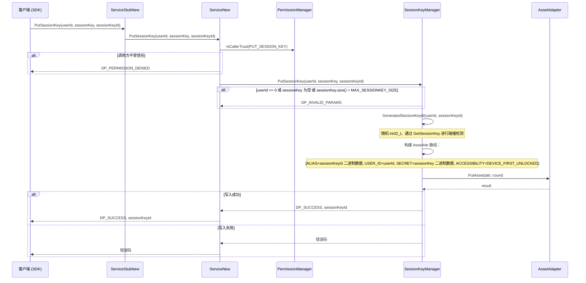
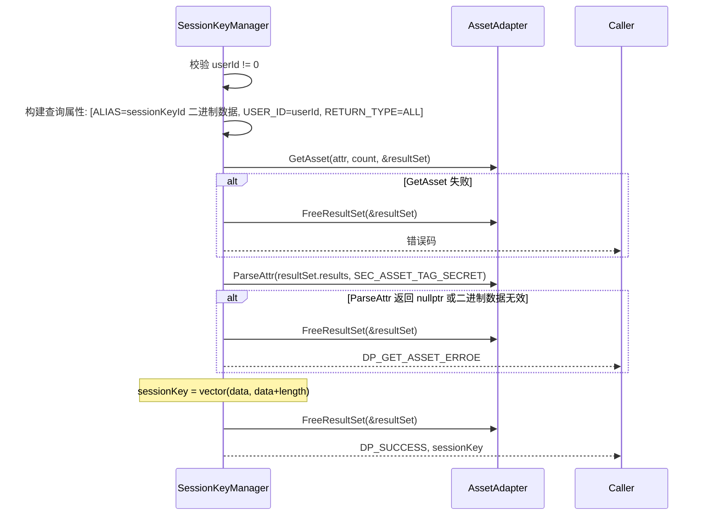
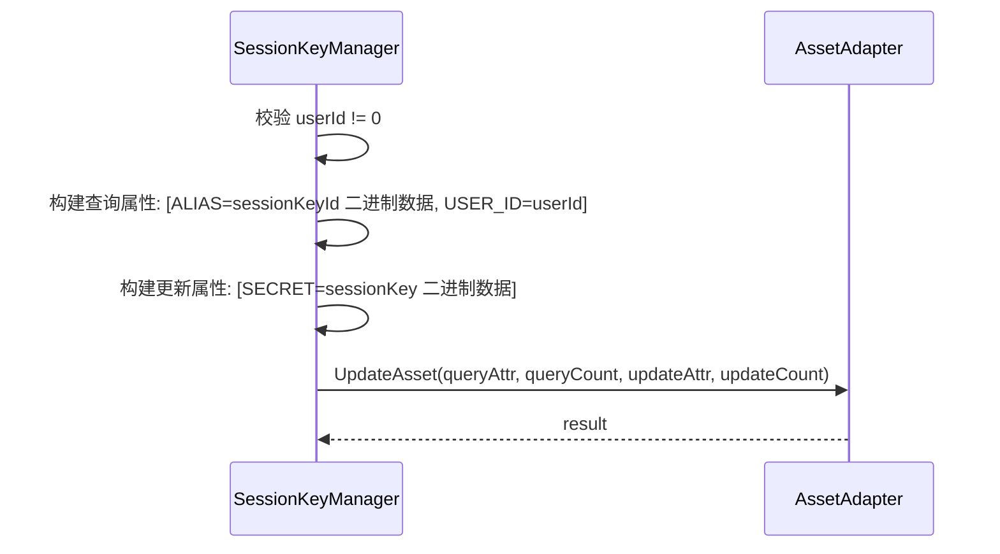
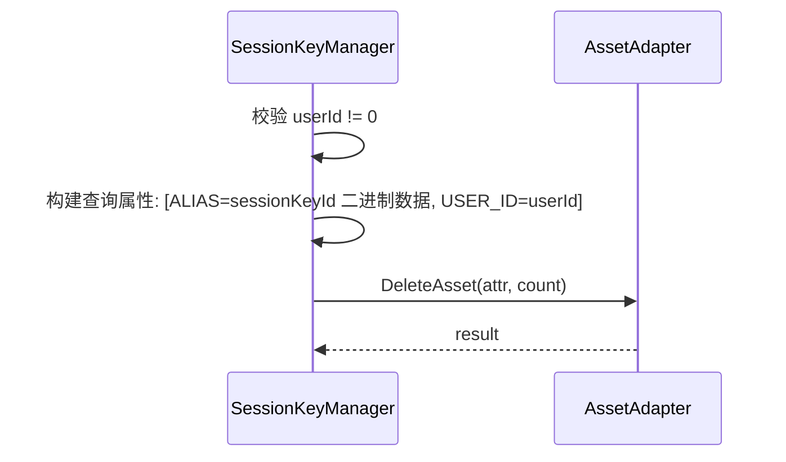
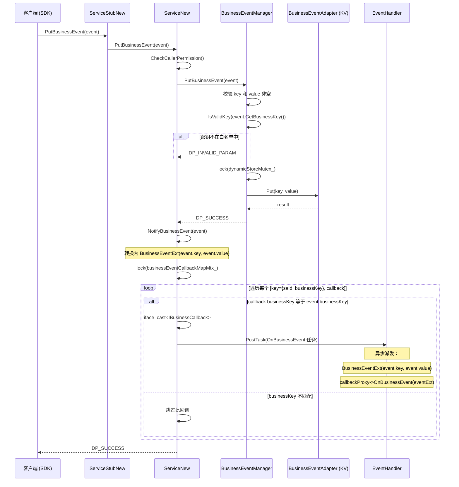

# 09 - 会话密钥与业务事件

会话密钥基于 Asset 加密存储的 CRUD 操作，以及业务事件通过 KV 存储的 CRUD 与回调派发机制。

---

## 1. PutSessionKey 时序

本节说明会话密钥的写入流程：从权限验证、参数校验、密钥 ID 碰撞检测，到构建 Asset 安全属性数组并调用 Asset 适配器写入加密存储的完整路径。

下图展示了 PutSessionKey 的调用链路：



关键步骤说明：
1. 调用方通过 SDK 发起 `PutSessionKey`，经过 IPC 到达 `ServiceNew`，首先检查调用方是否在 `PUT_SESSION_KEY` 的受信列表中。
2. `SessionKeyManager` 对参数进行校验：userId 不能为 0，sessionKey 不能为空，且大小不能超过 `MAX_SESSIONKEY_SIZE`。
3. 通过 `GeneratedSessionKeyId` 生成一个不与已有密钥冲突的随机 int32_t ID。生成逻辑采用碰撞避免循环：生成随机数后尝试读取，若已存在则重新生成，直到找到未使用的 ID。
4. 构建 Asset 属性数组：包含 ALIAS（密钥 ID 的二进制表示）、USER_ID、SECRET（密钥数据本身）和 ACCESSIBILITY（`DEVICE_FIRST_UNLOCKED` 安全级别）。
5. 调用 `AssetAdapter::PutAsset` 将加密数据写入硬件安全存储。成功则返回 `DP_SUCCESS` 及最终生成的 `sessionKeyId`。

### 会话密钥 ID 生成

```
GeneratedSessionKeyId(userId, sessionKeyId):
  do {
    seed = system_clock::now()
    randomNumber = uniform_int_distribution(0, INT32_MAX)
    ret = GetSessionKey(userId, randomNumber, sessionKey)
  } while (ret == DP_SUCCESS)   // 碰撞检测：若键已存在则重新生成

  sessionKeyId = randomNumber
```

ID 生成使用碰撞避免循环：生成一个随机 int32_t，然后尝试用该 ID 获取密钥。若获取成功（说明该 ID 已被占用），则重新生成。循环持续直到找到未使用的 ID。

**MAX_SESSIONKEY_SIZE** 是会话密钥字节向量的最大允许大小。

---

## 2. Get / Update / Delete 会话密钥时序

本节说明会话密钥的读取、更新和删除操作。

### GetSessionKey

下图展示了 GetSessionKey 的调用流程：



关键步骤说明：
1. 首先校验 userId 不为 0。
2. 构建查询属性数组：按 ALIAS（密钥 ID）和 USER_ID 定位记录，RETURN_TYPE 设为 `SEC_ASSET_RETURN_ALL` 以返回所有属性。
3. 调用 `AssetAdapter::GetAsset` 查询，若失败则释放结果集并返回错误。
4. 通过 `ParseAttr` 从结果中提取 `SEC_ASSET_TAG_SECRET` 对应的密钥数据。若返回 null 或二进制数据无效，返回 `DP_GET_ASSET_ERROE`。
5. 将提取的数据填充到 `sessionKey` 向量中，释放结果集并返回成功。

### UpdateSessionKey



关键步骤说明：
1. 校验 userId 不为 0。
2. 构建查询属性（按 ALIAS + USER_ID 定位）和更新属性（新的 SECRET 值）。
3. 调用 `AssetAdapter::UpdateAsset` 执行更新。

### DeleteSessionKey



关键步骤说明：
1. 校验 userId 不为 0。
2. 构建查询属性（按 ALIAS + USER_ID 定位）。
3. 调用 `AssetAdapter::DeleteAsset` 执行删除。

---

## 3. PutBusinessEvent 时序

本节说明业务事件的写入与通知流程：从密钥白名单校验、KV 存储写入，到遍历回调映射表并通过 EventHandler 异步派发业务事件通知的完整路径。

下图展示了 PutBusinessEvent 的调用链路：



关键步骤说明：
1. 调用方通过 SDK 发起 `PutBusinessEvent`，经权限检查后到达 `BusinessEventManager`。
2. 对 key 和 value 进行非空校验，然后通过 `IsValidKey` 检查 key 是否在预定义的白名单中。不在白名单中的 key 将被拒绝。
3. 加锁后通过 `BusinessEventAdapter`（底层为 KV 存储）写入键值对。
4. 写入成功后，调用 `NotifyBusinessEvent`：将事件转换为 `BusinessEventExt`，加锁遍历 `businessEventCallbackMap_`，对每个匹配 businessKey 的回调，通过 `iface_cast<IBusinessCallback>` 转换后，使用 `EventHandler::PostTask` 异步派发 `OnBusinessEvent` 回调。

---

## 4. 会话密钥 ID 生成

本节说明 `GeneratedSessionKeyId` 方法的实现细节。

- 使用 `std::default_random_engine`，以 `system_clock::now().time_since_epoch().count()` 作为种子
- 在 `[0, INT32_MAX]` 范围内生成随机 `int32_t`
- 通过调用 `GetSessionKey(userId, randomNumber, sessionKey)` 进行碰撞检测——若密钥已存在（返回 `DP_SUCCESS`），则重新生成
- 找到未冲突的 ID 后，将其赋值给输出参数
- 会话密钥 ID 在 Asset 存储中作为 `SEC_ASSET_TAG_ALIAS` 使用，支持按 ID 检索

---

## 5. Asset 安全属性

本节说明会话密钥在 Asset 存储中的安全属性配置，包括可访问性级别、标签结构和查询/更新/删除的属性定义。

### 可访问性级别

使用 `SEC_ASSET_ACCESSIBILITY_DEVICE_FIRST_UNLOCKED` 值，意味着会话密钥只能在设备自启动以来至少解锁一次后才能被访问。这可以防止在用户认证之前访问敏感密钥数据。

### 存储标签结构

每个会话密钥的 Asset 条目包含以下标签：

| 标签 | 值类型 | 描述 |
|---|---|---|
| `SEC_ASSET_TAG_ALIAS` | 二进制数据（sizeof(int32_t)） | 会话密钥 ID 的二进制表示 |
| `SEC_ASSET_TAG_USER_ID` | uint32 | 用户 ID，用于多用户隔离 |
| `SEC_ASSET_TAG_SECRET` | 二进制数据（sessionKey.size()） | 实际的会话密钥数据 |
| `SEC_ASSET_TAG_ACCESSIBILITY` | uint32 | 可访问性级别（DEVICE_FIRST_UNLOCKED） |

### 查询标签（用于 Get 操作）

| 标签 | 值类型 | 描述 |
|---|---|---|
| `SEC_ASSET_TAG_ALIAS` | 二进制数据 | 按会话密钥 ID 匹配 |
| `SEC_ASSET_TAG_USER_ID` | uint32 | 按用户 ID 匹配 |
| `SEC_ASSET_TAG_RETURN_TYPE` | uint32 | `SEC_ASSET_RETURN_ALL` -- 返回所有属性 |

### 更新标签

| 查询标签 | 更新标签 |
|---|---|
| `SEC_ASSET_TAG_ALIAS`, `SEC_ASSET_TAG_USER_ID` | `SEC_ASSET_TAG_SECRET`（新的密钥值） |

### 删除标签

| 查询标签 |
|---|
| `SEC_ASSET_TAG_ALIAS`, `SEC_ASSET_TAG_USER_ID` |

---

## 6. IPC 序列化后会话密钥的安全清理

本节说明会话密钥数据在 IPC 序列化完成后的内存安全处理。

会话密钥数据在整个调用链中以 `std::vector<uint8_t>` 形式传递。IPC 序列化完成后，服务端的密钥数据仅保留在 Asset 适配器的内部缓冲区和调用代码的局部变量中。由于 `std::vector<uint8_t>` 的析构函数在典型实现中会清零内存，且 Asset SDK 管理自身的安全内存，DP 服务代码本身不会显式清零密钥数据。但 `AssetAdapter` 会按照 Asset SDK 规范在内部管理安全内存。

**关键安全考量：**
- DP 服务不会记录原始会话密钥二进制数据（日志仅限于 userId 和 sessionKeyId）
- 密钥仅存储在硬件支持的 Asset 存储中，不会存入 KV 或 RDB
- `DEVICE_FIRST_UNLOCKED` 可访问性级别可防止在用户解锁设备之前访问密钥

---

## 7. 业务事件密钥白名单

本节说明业务事件密钥的白名单机制及允许的两个密钥。

仅允许以下两个业务事件密钥：

| 密钥常量 | 字符串值 | 用途 |
|---|---|---|
| `DP_REJECT_KEY` | `"business_id_cast+_reject_event"` | 拒绝事件通知 |
| `DP_DISTURBANCE_KEY` | `"business_id_cast+_disturbance_event"` | 打扰事件通知 |

白名单在 `BusinessEventManager` 中定义为 `std::set<std::string> validKeys_`。任何不在该集合中的密钥将被 `IsValidKey` 拒绝，返回 `DP_INVALID_PARAM`。

---

## 8. 业务回调注册与死亡接收

本节说明业务回调的注册、注销以及死亡回调的处理机制。

### 注册

```
RegisterBusinessCallback(saId, businessKey, businessCallback):
  1. CheckCallerPermission
  2. 校验 saId 非空、businessKey 非空、businessCallback 非空
  3. iface_cast<IBusinessCallback>(businessCallback)
  4. 若 {saId, businessKey} 已存在于 businessCallbackMap_ 中 -> DP_INVALID_PARAM
  5. 若 businessCallbackMap_.size() > MAX_CALLBACK_LEN (1000) -> DP_INVALID_PARAM
  6. businessCallbackMap_[{saId, businessKey}] = businessCallback
  7. 返回 DP_SUCCESS
```

### 注销

```
UnRegisterBusinessCallback(saId, businessKey):
  1. CheckCallerPermission
  2. 校验参数
  3. 从 businessCallbackMap_ 中擦除 {saId, businessKey}
  4. 若未找到 -> DP_INVALID_PARAM
```

### 死亡接收

`businessCallbackMap_` **没有**自动的死亡接收者清理机制。已失效的回调在通知期间处理：
- `iface_cast<IBusinessCallback>(callback)` 对已失效的代理返回 nullptr
- 在通知循环中跳过 null 回调
- 已失效的条目保留在映射表中，直到被显式注销

---

## 9. 错误码

| 错误码 | 上下文 |
|---|---|
| `DP_SUCCESS` | 操作成功完成 |
| `DP_INVALID_PARAMS` | 无效参数（userId==0、会话密钥为空、密钥大小超限、业务 key/value 为空、业务密钥无效） |
| `DP_INVALID_PARAM` | 无效的回调注册（saId 为空、businessKey 为空、回调为 null、重复注册、超过上限） |
| `DP_PERMISSION_DENIED` | 调用方不受信任或缺少权限 |
| `DP_GET_ASSET_ERROE` | Asset 查询返回 null 或无效的密钥数据 |
| `DP_PUT_BUSINESS_EVENT_FAIL` | KV 存储写入失败 |
| `DP_GET_BUSINESS_EVENT_FAIL` | KV 存储读取失败 |
| `DP_KV_DB_PTR_NULL` | BusinessEventAdapter 为空 |
| `DP_NULLPTR` | IPC 回调代理转换返回空指针 |
| `DP_NOTIFY_BUSINESS_EVENT_FAIL` | NotifyBusinessEvent PostTask 失败 |
| `DP_INIT_DB_FAILED` | BusinessEventAdapter 初始化失败 |

---

## 关键代码路径

| 操作 | 入口函数 | 关键文件 |
|---|---|---|
| 写入会话密钥 | `SessionKeyManager::PutSessionKey` | `services/core/src/sessionkeymanager/session_key_manager.cpp` |
| 获取会话密钥 | `SessionKeyManager::GetSessionKey` | `services/core/src/sessionkeymanager/session_key_manager.cpp` |
| 更新会话密钥 | `SessionKeyManager::UpdateSessionKey` | `services/core/src/sessionkeymanager/session_key_manager.cpp` |
| 删除会话密钥 | `SessionKeyManager::DeleteSessionKey` | `services/core/src/sessionkeymanager/session_key_manager.cpp` |
| 生成会话密钥 ID | `SessionKeyManager::GeneratedSessionKeyId` | `services/core/src/sessionkeymanager/session_key_manager.cpp` |
| Asset 写入 | `AssetAdapter::PutAsset` | `services/core/src/persistenceadapter/asset_adapter.cpp` |
| Asset 读取 | `AssetAdapter::GetAsset` | `services/core/src/persistenceadapter/asset_adapter.cpp` |
| Asset 更新 | `AssetAdapter::UpdateAsset` | `services/core/src/persistenceadapter/asset_adapter.cpp` |
| Asset 删除 | `AssetAdapter::DeleteAsset` | `services/core/src/persistenceadapter/asset_adapter.cpp` |
| 服务入口（PutSessionKey） | `ServiceNew::PutSessionKey` | `services/core/src/distributed_device_profile_service_new.cpp` |
| 写入业务事件 | `BusinessEventManager::PutBusinessEvent` | `services/core/src/businesseventmanager/business_event_manager.cpp` |
| 获取业务事件 | `BusinessEventManager::GetBusinessEvent` | `services/core/src/businesseventmanager/business_event_manager.cpp` |
| 校验业务密钥 | `BusinessEventManager::IsValidKey` | `services/core/src/businesseventmanager/business_event_manager.cpp` |
| 服务入口（PutBusinessEvent） | `ServiceNew::PutBusinessEvent` | `services/core/src/distributed_device_profile_service_new.cpp` |
| 注册业务回调 | `ServiceNew::RegisterBusinessCallback` | `services/core/src/distributed_device_profile_service_new.cpp` |
| 注销业务回调 | `ServiceNew::UnRegisterBusinessCallback` | `services/core/src/distributed_device_profile_service_new.cpp` |
| 通知业务事件 | `ServiceNew::NotifyBusinessEvent` | `services/core/src/distributed_device_profile_service_new.cpp` |
